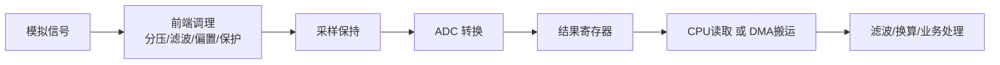
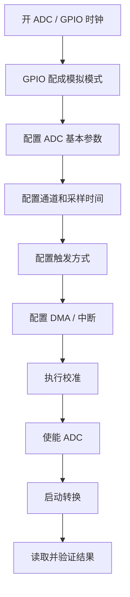

# ADC 全部知识整理与面试问答

> 这份文件面向嵌入式面试准备，目标不是只记定义，而是把 ADC 的核心原理、工程实现和面试高频问题串起来。
> 回答结构默认统一为：
> 1. 先直接回答
> 2. 再展开解释
> 3. 最后补工程补充

## 1. ADC 是什么

### 1.1 基本定义

ADC，`Analog-to-Digital Converter`，模数转换器。  
它的作用是把连续变化的模拟电压，转换成 MCU 可以处理的数字量。

一句话理解：

- 传感器、电位器、麦克风、NTC 等很多器件给出来的是模拟量
- MCU 内部只能直接处理数字量
- ADC 就是两者之间的桥梁

### 1.2 为什么 MCU 需要 ADC

因为现实世界里很多信号本来就是模拟信号，比如：

- 电压
- 电流
- 温度
- 光强
- 声音
- 模拟传感器输出

如果没有 ADC，MCU 只能处理高低电平，无法直接量化这些连续信号。

## 2. ADC 的核心概念

### 2.1 分辨率

分辨率表示 ADC 能把输入电压划分成多少级。

常见有：

- 8 位
- 10 位
- 12 位
- 14 位
- 16 位

如果是 `N` 位 ADC，那么理论上会把输入范围分成：

`2^N` 个等级

例如：

- 8 位：256 级
- 10 位：1024 级
- 12 位：4096 级

### 2.2 参考电压

参考电压 `Vref` 决定 ADC 的量程上限。  
例如一个 12 位 ADC，`Vref = 3.3V`，那么：

- 输入 `0V` 对应接近 `0`
- 输入 `3.3V` 对应接近 `4095`

常见公式：

`ADC值 / (2^N - 1) = Vin / Vref`

换算得到：

`Vin = ADC值 * Vref / (2^N - 1)`

### 2.3 量化误差

ADC 不是连续测量，而是“分档”测量，所以一定有量化误差。  
输入电压落在某个区间时，会被量化成最近的数字值。

一句话理解：

ADC 不是真正“精确还原”，而是“离散近似表示”。

### 2.4 采样频率

采样频率表示单位时间内采样多少次。  
对于慢变量，比如温度、电池电压，采样率不需要很高；  
对于音频、振动、电机电流波形，就需要更高采样率。

### 2.5 转换时间

ADC 不是瞬间完成转换的，它需要：

- 采样时间
- 保持时间
- 转换时间

总转换时间越短，单位时间内能完成的采样就越多。

## 3. ADC 的工作流程

从工程角度看，ADC 一般经历这几个步骤：

1. 模拟信号输入
2. 采样保持
3. 模数转换
4. 输出数字结果
5. MCU 读取结果或 DMA 搬运结果

### 3.0 图示：ADC 信号链路

### 3.1 采样保持

ADC 内部通常先用采样电容对输入信号采样，并在短时间内保持住这个电压，再进行后续转换。

这也是为什么：

- 信号源阻抗太大时，采样不一定准
- 采样时间设置太短时，也会带来误差

### 3.2 转换原理

面试里最常见的 ADC 类型是逐次逼近型 `SAR ADC`。

它的核心思路是：

- 从最高位开始试探
- 每次判断当前试探值是偏大还是偏小
- 一位一位逼近最终结果

它的特点是：

- 速度较快
- 结构适合 MCU 内部集成
- 精度和成本平衡比较好

## 4. 常见 ADC 类型

### 4.1 SAR ADC

最常见的 MCU 内置 ADC 类型。  
优点：

- 速度较快
- 功耗较低
- 成本适中

### 4.2 Flash ADC

特点是极快，但硬件代价高。  
通常用于超高速采样场景，不常见于普通 MCU。

### 4.3 Sigma-Delta ADC

特点是高分辨率、高精度，适合低频高精度测量。  
常用于：

- 精密测量
- 称重
- 工业采集

### 4.4 双积分 ADC

常见于高精度但低速场景，比如万用表类设备。

## 5. 常见工作模式

### 5.1 单次转换

触发一次，转换一次。  
适合偶尔读取某一路模拟值。

### 5.2 连续转换

ADC 自动不断重复采样和转换。  
适合需要周期采样的场景。

### 5.3 扫描模式

对多个通道依次采样。  
适合多路传感器采集。

### 5.4 注入通道

某些 MCU 支持规则通道和注入通道。  
注入通道通常可在特定时机优先转换，适合更关键的采样任务。

### 5.5 外部触发

通过定时器、PWM 事件或外部事件触发 ADC。  
这样能让采样时刻更稳定、更可控。

## 6. ADC 和 DMA

### 6.1 为什么 ADC 常和 DMA 搭配

因为 ADC 连续采样时，如果每次都靠 CPU 去读寄存器，会带来：

- CPU 占用高
- 实时性差
- 容易丢数据

所以常用 `ADC + DMA`：

- ADC 转换完成后把结果写到寄存器
- DMA 自动搬到内存缓冲区
- CPU 后续再统一处理

### 6.2 工程价值

`ADC + DMA` 的核心价值是：

- 降低 CPU 负担
- 适合多通道连续采样
- 适合高频率数据采集

## 7. ADC 精度相关问题

### 7.1 为什么 ADC 读值会抖动

常见原因有：

- 电源噪声
- 参考电压不稳
- 输入信号本身有噪声
- 采样时间不足
- 布线耦合干扰
- 信号源阻抗过大

### 7.2 如何让 ADC 更稳定

常见方法：

- 增大采样时间
- 做多次采样平均
- RC 滤波
- 使用更稳定的参考电压
- 模拟地和数字地合理处理
- 缩短走线，减小耦合

### 7.3 采样时间为什么会影响精度

因为 ADC 采样前要给内部采样电容充电。  
如果输入源阻抗较大，而采样时间又太短，采样电容还没充到真实输入值，就开始转换了，结果自然偏差更大。

## 8. ADC 常见前端设计问题

### 8.1 为什么有些信号不能直接进 ADC

因为 ADC 输入通常有这些限制：

- 量程不能超 `Vref`
- 电压不能为负
- 输入阻抗和驱动能力要匹配

所以很多信号要先做：

- 分压
- 放大
- 偏置
- 滤波
- 限幅保护

### 8.2 分压为什么常用

如果输入电压超过 ADC 可测范围，比如测电池、电源电压，就需要先通过电阻分压把电压压到 ADC 可接受范围内。

### 8.3 RC 滤波为什么常用

因为 ADC 不想看到太多高频噪声，RC 滤波可以先把高频干扰压掉，让输入更平滑。

## 9. ADC 更深入的指标与原理

### 9.1 偏移误差

偏移误差可以理解成：

- 理论上输入 `0V` 时应输出 `0`
- 但实际输出可能不是 `0`

这类整体平移型误差叫偏移误差。

### 9.2 增益误差

增益误差可以理解成：

- 零点可能是对的
- 但整条输入输出斜率不完全对

也就是量程两端缩放关系有偏差。

### 9.3 DNL

`DNL`，`Differential Non-Linearity`，微分非线性。  
它反映的是：

- 相邻两个量化台阶的宽度是不是均匀

如果某些码宽过大或过小，说明 DNL 不理想。

### 9.4 INL

`INL`，`Integral Non-Linearity`，积分非线性。  
它反映的是：

- 实际转换曲线相对理想直线偏离了多少

一句话理解：

- `DNL` 看局部台阶均不均匀
- `INL` 看整体曲线偏不偏

### 9.5 SNR / SINAD / ENOB

这是更偏高阶的 ADC 指标，面试官有时会顺着问。

#### SNR

`Signal-to-Noise Ratio`，信噪比。  
表示有用信号和噪声的比值。

#### SINAD

`Signal-to-Noise and Distortion Ratio`，信号与噪声加失真比。  
它比单纯 SNR 更接近真实系统表现。

#### ENOB

`Effective Number Of Bits`，有效位数。  
表示 ADC 在真实噪声和失真条件下，相当于还有多少位是“真正有用”的。

一句话理解：

- 名义分辨率是芯片标出来的位数
- `ENOB` 是你真正能用出来的有效位数

## 10. 采样定理与混叠

### 10.1 采样定理是什么

采样定理最核心的一句是：

如果要无失真恢复一个最高频率为 `fmax` 的信号，采样频率要大于 `2 * fmax`。

这就是奈奎斯特采样定理。

### 10.2 什么是奈奎斯特频率

奈奎斯特频率可以理解成：

`采样频率的一半`

也就是：

`fs / 2`

### 10.3 什么是混叠

如果输入信号里有高于奈奎斯特频率的成分，而你又没有先把它滤掉，那么这些高频成分会“折叠”到低频区，看起来像别的频率，这种现象就叫混叠。

一句话理解：

**采样不够快，或者前端没先滤波，高频信息就会伪装成低频信息。**

### 10.4 为什么 ADC 前面常要加抗混叠滤波

因为 ADC 只能按固定频率采样，没法自动区分“这部分高频是不是应该采”。  
所以工程上常在 ADC 前面放低通滤波器，把超出可采频带的高频成分先削掉，这就叫抗混叠滤波。

## 11. 输入源阻抗与前端缓冲

### 11.1 为什么信号源阻抗会影响 ADC

因为 ADC 采样时内部采样电容需要从外部信号源“取电”来充电。  
如果信号源阻抗太大，相当于供电路径太软，采样电容在有限采样时间内可能充不满，最终测量值就会偏差。

### 11.2 什么时候要加运放缓冲

如果出现这些情况，通常会考虑在 ADC 前加缓冲运放：

- 信号源阻抗比较大
- 前级驱动能力弱
- 需要把传感器信号稳定地推给 ADC
- 还想顺便做放大、偏置或滤波

运放缓冲的作用本质上是：

- 提高驱动能力
- 降低等效输出阻抗
- 让 ADC 更容易稳定采样

## 12. 校准、过采样和平均

### 12.1 ADC 校准是做什么的

校准的核心目的是：

- 修正 ADC 内部的偏移、增益或器件偏差
- 让实际测量更接近理想结果

很多 MCU 的 ADC 支持上电后自校准，这通常是一个很值得做的步骤。

### 12.2 过采样是什么

过采样就是：

- 用比目标带宽更高的频率采样
- 再通过平均、滤波或抽取获得更平滑的结果

它的价值通常是：

- 降低随机噪声影响
- 在某些场景下提升等效分辨能力

### 12.3 过采样是不是等于分辨率一定变高

不是。  
过采样更准确的说法是：

- 在有一定随机噪声抖动前提下
- 通过更多样本统计，提升等效测量精细度

它不是无条件白送高精度。

### 12.4 多次平均为什么有效

因为很多噪声是随机分布的。  
多次采样平均后，随机噪声会部分相互抵消，而真实直流成分会被保留下来，所以结果更稳定。

## 13. 多 ADC、同步采样与规则/注入通道

### 13.1 多 ADC 同步采样和扫描采样有什么区别

同步采样更强调：

- 多路信号在同一个时刻一起采

扫描采样更强调：

- 一个 ADC 按顺序轮流采多个通道

如果你关心多个信号之间严格的相位关系，比如三相电流、电机控制、电源同步测量，那么同步采样更重要。

### 13.2 规则通道和注入通道有什么区别

规则通道是普通采样主流程。  
注入通道更像“优先级更高、时机更特殊”的采样任务。

通常可以理解成：

- 规则通道负责常规批量采样
- 注入通道负责关键时刻的额外采样

### 13.3 为什么电机控制里很喜欢用 ADC 外部触发和注入通道

因为电机控制更在意：

- 在 PWM 的特定相位点采样
- 避免在电流纹波最大或开关噪声最强的时候采

所以常用定时器事件精确触发 ADC，必要时再结合注入通道做更关键的同步采样。

## 14. STM32 / MCU 工程实现视角

### 14.1 用 MCU 内置 ADC 做采样，软件上通常要配置什么

常见会配置这些内容：

- ADC 时钟
- 对应 GPIO 模拟模式
- 通道选择
- 分辨率
- 采样时间
- 转换序列
- 触发方式
- 连续/单次模式
- DMA
- 中断

### 14.2 为什么 GPIO 要配成模拟模式

因为如果不设为模拟模式，数字输入结构可能还挂在引脚上，会增加不必要的功耗和干扰，也不利于纯模拟采样。

### 14.3 ADC 结果左对齐和右对齐是什么意思

就是：

- 转换结果放进数据寄存器时，按高位还是低位对齐

通常：

- 右对齐更直观，直接看数值方便
- 左对齐有时便于只取高位快速处理

### 14.4 ADC 初始化流程怎么走

从工程实现角度，ADC 初始化一般可以按下面顺序理解：

1. **打开时钟**
- 开 ADC 外设时钟
- 开对应 GPIO 端口时钟
- 如果芯片有单独的 ADC 时钟源，还要确认时钟分频配置

2. **配置 GPIO 为模拟模式**
- 把 ADC 对应引脚设为模拟输入
- 关闭不必要的数字输入输出功能

3. **配置 ADC 基本参数**
- 分辨率
- 数据对齐方式
- 单次/连续转换
- 扫描模式
- 规则通道或注入通道

4. **配置通道与采样时间**
- 选择具体采样通道
- 设置通道序列
- 设置每个通道采样时间

5. **配置触发方式**
- 软件触发
- 定时器触发
- 外部事件触发

6. **配置中断或 DMA**
- 如果低频采样，可以只读结果寄存器或用中断
- 如果连续采样、多通道、高频采样，通常会配 DMA

7. **做 ADC 校准**
- 某些 MCU 支持 ADC 自校准
- 在正式开始采样前做一次校准，通常更稳

8. **使能 ADC**
- 打开 ADC
- 等待 ADC 稳定或 ready 标志

9. **启动转换**
- 软件触发启动
- 或等待外部触发源启动

10. **读取结果并验证**
- 看数据寄存器或 DMA 缓冲区是否有更新
- 用已知电压点验证是否合理

一句话记忆可以收成：

**开时钟 -> 配 GPIO -> 配 ADC 参数 -> 配通道和采样时间 -> 配触发 -> 配 DMA/中断 -> 校准 -> 使能 -> 启动 -> 验证**

### 14.7 图示：ADC 初始化流程

### 14.5 初始化时最容易漏掉什么

最容易漏的通常有这些：

- GPIO 没切到模拟模式
- ADC 时钟没开或时钟源不对
- 通道号配错
- 采样时间太短
- DMA 没和 ADC 对上
- 忘了做校准
- 触发源配了但根本没真正触发

### 14.6 初始化完成后怎么确认 ADC 真的工作了

可以按这几个层次确认：

1. 看寄存器或状态位有没有 ready / end of conversion
2. 看结果寄存器是不是在变化
3. 给输入一个明确的已知电压，比如 `0V`、`Vref/2`、`Vref`
4. 如果配了 DMA，看缓冲区数据是否更新
5. 多测几个点，确认不是偶然值

## 15. ADC 常见排障思路

### 15.1 ADC 一直读 0，怎么排查

可以从这些方向查：

1. GPIO 是否真配成了模拟输入
2. ADC 时钟是否开了
3. 通道是否选对
4. 触发有没有真正发生
5. 输入电压是不是本来就接近 0
6. DMA 或读取代码是不是有问题

### 15.2 ADC 一直读满量程，怎么排查

常见可能性有：

- 输入电压超过量程
- 分压设计错了
- 输入脚悬空或被上拉
- 通道选错了
- 参考电压异常

### 15.3 ADC 数值总是偏小，怎么排查

重点看：

- 分压比是不是算错
- 参考电压是不是比预期低
- 采样时间是否不足
- 信号源阻抗是否过大
- 前端滤波或运放有没有引入压降

### 15.4 ADC 数值周期性抖动，常见原因是什么

可能是：

- 电源纹波
- PWM 开关噪声耦合
- 采样触发时机刚好卡在干扰点
- 地弹噪声
- 布线耦合

### 15.5 软件滤波和硬件滤波怎么取舍

一般原则是：

- 高频干扰太强，优先先做硬件侧基础滤波
- 随机抖动和显示平滑问题，软件滤波很合适

最常见的工程做法不是二选一，而是：

**硬件先做基础净化，软件再做进一步平滑。**

## 16. ADC 初始化相关高频问题

### Q16. 你说一下 ADC 初始化的大致流程。

**直接回答：**
ADC 初始化通常就是按“开时钟、配 GPIO、配 ADC 参数、配通道和采样时间、配触发、配 DMA/中断、校准、使能、启动”的顺序来做。

**展开解释：**
先把 ADC 和 GPIO 的时钟打开，再把对应引脚切成模拟模式，然后配置分辨率、对齐方式、连续/单次模式、扫描模式这些基本参数。接下来配置具体通道和采样时间，再决定是软件触发还是外部触发。如果要连续高频采样，就会把 DMA 也一起配好。最后做校准、使能 ADC、启动转换，再通过寄存器或 DMA 缓冲区确认结果是否合理。

**工程补充：**
这题最重要的不是背 API，而是把“上电到出数”的工程链路讲顺。

### Q17. ADC 初始化时为什么 GPIO 要配成模拟模式？

**直接回答：**
因为 ADC 引脚本质上要接收模拟电压，设成模拟模式能减少数字电路干扰和额外功耗。

**展开解释：**
如果 GPIO 还保持数字输入输出结构，数字施密特触发器等电路可能仍然挂在引脚上，这对纯模拟采样不是最理想状态，也可能带来不必要的功耗和干扰。

**工程补充：**
这是很基础但非常高频的追问点。

### Q18. ADC 初始化后一直读不到正确结果，你先查什么？

**直接回答：**
我会先查时钟、GPIO 模式、通道配置和触发链路这四件事。

**展开解释：**
因为很多 ADC “没工作”的问题，不是算法问题，而是初始化链路本身就没打通。最先看：

1. ADC 时钟有没有开
2. GPIO 有没有设成模拟模式
3. 通道是不是选对了
4. 转换有没有真的被触发

如果这些都没问题，再往 DMA、中断、参考电压和输入信号本身去查。

**工程补充：**
这题最好体现“先查最短链路”的排障习惯。

### Q19. 为什么有些 MCU 在 ADC 初始化后建议先做校准？

**直接回答：**
因为校准可以修正 ADC 内部偏差，让后续测量更稳定、更接近真实值。

**展开解释：**
ADC 内部器件会有偏移和工艺误差，校准可以在正式采样前先做一次内部修正。很多 MCU 的手册也会建议上电后或使能前先执行校准流程。

**工程补充：**
如果你没做过具体芯片的校准，也可以把它讲成“很多平台推荐步骤，不一定每个项目都忽略得起”。

### Q20. ADC 初始化里，采样时间一般什么时候开始重点考虑？

**直接回答：**
当输入源阻抗较大、精度要求高，或者你发现读值偏差明显时，就要重点考虑采样时间。

**展开解释：**
如果只是低阻、简单信号，默认采样时间可能就够；但如果是分压后测电压、前级驱动弱、信号比较敏感，就很容易因为采样时间不足导致误差，这时就要调长采样时间去验证。

**工程补充：**
这题很适合和“为什么采样时间影响精度”连起来答。

## 9. ADC 面试高频问题与回答

### Q1. ADC 是什么？

**直接回答：**
ADC 是模数转换器，用来把模拟信号转换成数字信号，方便 MCU 处理。

**展开解释：**
现实中的温度、电压、电流、声音等很多量都是连续变化的模拟量，MCU 不能直接理解这类连续信号，所以需要 ADC 先把它量化成数字值。

**工程补充：**
一句话记忆就是：
“ADC 是 MCU 感知模拟世界的入口。”

### Q2. 12 位 ADC 代表什么意思？

**直接回答：**
12 位 ADC 表示它能把输入范围量化成 `2^12 = 4096` 个等级。

**展开解释：**
如果参考电压是 `3.3V`，那么 ADC 输出大致在 `0~4095` 之间变化，不同输入电压会映射到不同数字值。

**工程补充：**
面试官常会顺手追问分辨率、量程和最小分辨电压。

### Q3. 12 位 ADC，`Vref = 3.3V`，最小分辨电压是多少？

**直接回答：**
理论上最小分辨电压约为 `3.3 / 4096 ≈ 0.805mV`。

**展开解释：**
12 位 ADC 有 4096 个量化等级，所以每一级大约对应 `0.805mV`。严格说有时也会写成 `Vref / (2^N - 1)`，但面试里说近似值即可。

**工程补充：**
要记住这是理论分辨率，不等于实际精度。

### Q4. 分辨率越高，是不是精度就一定越高？

**直接回答：**
不是，分辨率高不等于实际精度一定高。

**展开解释：**
分辨率只说明量化等级更多，但真实测量还会受到噪声、参考电压、非线性误差、前端电路、采样时间等影响。所以一个高位 ADC，如果参考不稳或噪声很大，实际效果也未必好。

**工程补充：**
一句很稳的话术是：
“分辨率是理论能力，精度还取决于整个模拟链路质量。”

### Q5. ADC 为什么会有量化误差？

**直接回答：**
因为 ADC 是把连续模拟量映射成离散数字量，本质上就是近似，不可能完全无误差。

**展开解释：**
输入电压在某个范围内都会被量化成同一个数字值，所以一定存在量化误差。这个误差通常和分辨率有关，分辨率越高，量化台阶越细，误差通常越小。

**工程补充：**
量化误差是 ADC 天生就有的，不是程序写得不好才有。

### Q6. ADC 为什么常常和 DMA 一起用？

**直接回答：**
因为连续采样时，用 DMA 能降低 CPU 负担并提高采集效率。

**展开解释：**
如果 ADC 每转换一次都靠 CPU 去读结果寄存器，CPU 负担会很重，而且高频采样时容易跟不上。配合 DMA 后，ADC 结果可以自动搬到内存缓冲区，CPU 后面统一处理即可。

**工程补充：**
这是非常典型的“外设采样 + DMA 搬运 + CPU 后处理”架构。

### Q7. ADC 读值为什么会抖动？

**直接回答：**
因为模拟链路天然容易受噪声影响，ADC 采样本身也不可能完全理想。

**展开解释：**
常见原因包括电源噪声、参考电压不稳、输入信号噪声、采样时间不足、布线干扰、信号源阻抗过大等。

**工程补充：**
这题最好顺手带上解决思路，比如滤波、平均、延长采样时间。

### Q8. 如果 ADC 数值不稳定，你怎么处理？

**直接回答：**
我会先区分是模拟链路问题还是数字处理问题，再决定是从硬件侧还是软件侧优化。

**展开解释：**
硬件侧可以看参考电压、供电噪声、RC 滤波、布局布线、信号源阻抗；软件侧可以做多次采样平均、滑动平均、中值滤波等。  
如果是采样时间太短，也需要调整 ADC 配置。

**工程补充：**
面试时别只答“加滤波”，要体现“先定位原因，再选手段”。

### Q9. 采样时间为什么重要？

**直接回答：**
因为采样时间决定 ADC 内部采样电容是否有足够时间跟踪输入电压。

**展开解释：**
如果输入源阻抗较大，而采样时间太短，采样电容来不及充到真实输入值，就会导致测量偏差。采样时间长一些通常更稳，但会降低整体采样速度。

**工程补充：**
这题特别适合体现你理解“速度和精度的取舍”。

### Q10. 多通道 ADC 扫描是怎么做的？

**直接回答：**
多通道扫描就是 ADC 按预设顺序依次对多个通道进行采样和转换。

**展开解释：**
通常会提前配置好通道顺序、采样时间和触发方式，然后 ADC 自动按序列逐个转换。配合 DMA 时，多个通道结果会按顺序存进内存缓冲区。

**工程补充：**
面试官有时会追问：
“DMA 缓冲区里多通道数据顺序是什么样的？”

### Q11. 为什么有些信号要先分压才能进 ADC？

**直接回答：**
因为 ADC 输入范围有限，超过参考电压就可能测不准甚至损坏输入端。

**展开解释：**
比如 MCU ADC 通常只能测 `0~3.3V`，但你要测电池、电源总线电压时，原始电压可能更高，这时就需要先做电阻分压，把信号压到可测范围内。

**工程补充：**
除了分压，有时还要配限幅保护和滤波。

### Q12. 外部触发 ADC 有什么好处？

**直接回答：**
外部触发能让 ADC 采样时刻更稳定、更可控。

**展开解释：**
比如用定时器触发 ADC，可以让采样严格按固定周期进行；用 PWM 相关事件触发，则可以让采样和控制波形在时间上更同步。这样比纯软件触发更稳定，抖动也更小。

**工程补充：**
这在电机控制、功率控制和同步采样场景里特别常见。

### Q13. 实际工程中 ADC 常见的误差来源有哪些？

**直接回答：**
常见误差来源包括量化误差、参考电压误差、噪声、非线性误差、采样时间不足和前端电路误差。

**展开解释：**
量化误差是 ADC 天生就有的；参考电压误差会直接影响量程换算；噪声和布线干扰会让读值抖动；前端电阻、电容、运放误差也会影响结果。

**工程补充：**
这题回答越像“系统链路分析”，越显得你真做过。

### Q14. 为什么说“理论分辨率”不等于“有效精度”？

**直接回答：**
因为理论分辨率只看位数，而有效精度还会被噪声和误差限制。

**展开解释：**
比如 12 位 ADC 理论上有 4096 级，但如果后几位一直在噪声里抖动，那真正可用的信息可能没那么多。也就是说，实际可用精度常常低于理论位数。

**工程补充：**
如果面试官继续追问，可以顺着讲 `ENOB`，但如果没被问到，不必主动展开太深。

### Q15. 什么时候会考虑外置 ADC，而不是 MCU 内置 ADC？

**直接回答：**
当内置 ADC 的精度、通道数、采样速度或特殊功能满足不了需求时，会考虑外置 ADC。

**展开解释：**
比如要更高精度、更高分辨率、更多通道、隔离采样，或者需要特殊接口和更好的模拟性能时，内置 ADC 可能不够。这时就会选外置 ADC 芯片。

**工程补充：**
内置 ADC 优点是成本低、集成方便；外置 ADC 优点是性能更强、选择更多。

## 17. ADC 面试高频问题与回答补充

### Q21. ADC 为什么需要参考电压？如果参考电压不稳会怎样？

**直接回答：**
因为 ADC 的数字结果本质上是相对参考电压量化出来的，参考不稳，结果就会跟着漂。

**展开解释：**
ADC 并不是直接“读电压绝对值”，而是把输入电压和 `Vref` 做比例映射。如果 `Vref` 本身在抖动，那么即使输入信号不变，换算出来的数字值也会变。

**工程补充：**
这也是为什么高精度测量场景非常重视参考电压稳定性。

### Q22. ADC 输入前为什么常加 RC 滤波，而不是完全靠软件滤波？

**直接回答：**
因为有些高频噪声必须在进入 ADC 之前就压掉，软件只能处理已经采进来的数据。

**展开解释：**
如果高频噪声已经进入 ADC，并且超出了合理采样带宽，它可能会产生混叠，这时软件再处理已经晚了。所以 RC 滤波不只是“让曲线更好看”，还是前端抗混叠和降噪的重要手段。

**工程补充：**
一句话就是：
“硬件滤波解决的是别让脏东西进来，软件滤波解决的是进来后怎么处理得更稳。”

### Q23. 什么时候适合用 ADC 中断，什么时候适合 DMA？

**直接回答：**
低频、少量、偶发采样适合中断；高频、连续、多通道采样更适合 DMA。

**展开解释：**
如果只是偶尔读一个电压值，中断方式足够简单直接；但如果要连续采样、多通道扫描或者高采样率获取波形，靠中断逐次读取会让 CPU 负担很重，这时 DMA 更合适。

**工程补充：**
这个回答要体现“根据数据量和实时性选方案”，不要机械说 DMA 一定更好。

### Q24. 为什么说采样时间和采样频率不是一回事？

**直接回答：**
采样时间是单次采样窗口长短，采样频率是单位时间采多少次，它们相关但不是同一个概念。

**展开解释：**
采样时间决定内部采样电容能否稳定跟踪输入，偏向精度问题；采样频率决定你多久取一次样，偏向时间分辨率问题。采样时间太短会影响单次结果是否准确，采样频率太低会影响时域信息是否完整。

**工程补充：**
这题能帮你把“精度”和“时间分辨率”两个维度分开讲清楚。

### Q25. 为什么理论上算出来最小分辨电压很小，但实际测量没有那么准？

**直接回答：**
因为理论分辨率只考虑位数和参考电压，实际测量还受噪声、误差和前端链路限制。

**展开解释：**
比如 12 位、3.3V 理论步进约 `0.805mV`，但现实里参考电压抖动、布线噪声、前端误差、ADC 非线性都会影响结果，所以真正稳定可用的精细度往往没那么理想。

**工程补充：**
这题最稳的收束就是：
“理论步进不等于真实可用精度。”

## 18. ADC 面试可能继续追问的问题清单

下面这些问题也很常见，后面你可以继续拿来扩展：

1. ADC 的采样定理是什么？
2. 什么是奈奎斯特采样频率？
3. 为什么采样频率太低会混叠？
4. ADC 输入前为什么常加 RC 滤波？
5. 为什么有时要加运放缓冲？
6. 为什么信号源阻抗会影响 ADC 采样？
7. ADC 校准是做什么的？
8. 多路 ADC 同步采样和轮询采样有什么区别？
9. 注入通道和规则通道有什么区别？
10. ADC 中断方式和 DMA 方式怎么选？
11. 为什么参考电压稳定性这么重要？
12. 如果 ADC 测出来总是偏小，你会从哪些方向排查？
13. 如果 ADC 采出来有周期性抖动，可能是什么问题？
14. ADC 和 PWM 常见的联动场景有哪些？
15. 如果你要做电池电压检测，会怎么设计前端？

## 19. 推荐复习顺序

如果你要快速准备 ADC 面试，建议按这个顺序复习：

1. ADC 是什么、分辨率、参考电压
2. 量化误差、理论分辨率和实际精度
3. 采样时间、输入阻抗、采样保持
4. 单次、连续、扫描、外部触发
5. ADC + DMA
6. 读值抖动原因与优化
7. 分压、滤波、前端设计
8. 高频面试题 15 问

## 20. 一句话总总结

ADC 面试里最重要的不是把概念背全，而是把下面这条链路讲顺：

**模拟信号来源 -> 前端调理 -> ADC 采样与转换 -> 数据搬运 -> 软件滤波与换算 -> 工程误差分析**
