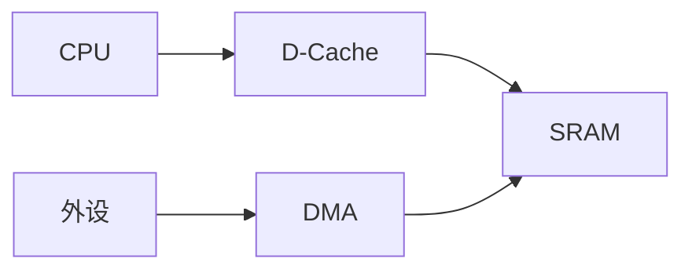
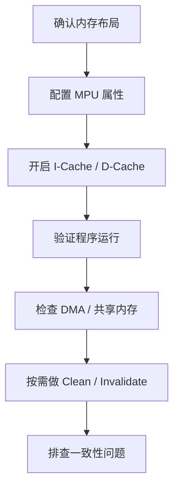

# Cache 全部知识整理与面试问答

> 这份文件面向嵌入式面试准备，这里的 `Cache` 默认重点放在 `Cortex-M7 / H7` 这类带 `I-Cache / D-Cache` 的 MCU 场景。
> 回答结构默认统一为：
> 1. 先直接回答
> 2. 再展开解释
> 3. 最后补工程补充

## 1. Cache 是什么

### 1.1 基本定义

Cache，本质上是一块**更小、更快的高速缓冲存储**。  
它的作用是把 CPU 最近经常访问的数据或指令先缓存起来，减少每次都去慢速存储器取数据的时间。

一句话理解：

**Cache 不是增加存储容量，而是用空间换时间。**

### 1.2 为什么需要 Cache

因为 CPU 的运行速度通常比外部 Flash、SRAM、SDRAM 或总线访问速度更快。  
如果每次取指令、读数据都要直接访问慢速存储器，CPU 会经常“等内存”，系统效率就会下降。

所以引入 Cache 的目的就是：

- 减少平均访问延迟
- 提高取指和访存效率
- 提高整体系统性能

## 2. Cache 的核心思想

### 2.1 局部性原理

Cache 能成立，核心依赖两种局部性：

#### 时间局部性

如果一个数据刚被访问过，那么它很可能很快又会被访问。

#### 空间局部性

如果一个地址被访问了，那么它附近的地址也很可能会被访问。

这就是为什么：

- 指令顺序执行时，I-Cache 很有效
- 数组顺序访问时，D-Cache 很有效

### 2.2 Cache Line

Cache 不是按 1 字节、1 字节缓存的，而是按一整块来缓存，这一整块就叫 `Cache Line`。

常见理解：

- CPU 访问某个地址
- 如果没命中，Cache 会把包含这个地址的整条 line 一起取进来

这样做是为了利用空间局部性。

### 2.3 命中与未命中

#### Cache Hit

CPU 要的数据已经在 Cache 里，直接取，速度快。

#### Cache Miss

CPU 要的数据不在 Cache 里，需要去更慢的存储器取，然后再回填到 Cache。

一句话理解：

**Cache 快不快，核心看命中率。**

### 2.4 公式：平均访问时间

面试里如果想答得更“系统化”，可以记这个公式：

`AMAT = Hit Time + Miss Rate × Miss Penalty`

含义是：

- `Hit Time`：命中时访问代价
- `Miss Rate`：未命中概率
- `Miss Penalty`：未命中后去下层存储取数的额外代价

一句话理解：

**Cache 的价值，本质上就是尽量降低平均访问时间。**

## 3. I-Cache 和 D-Cache

### 3.1 I-Cache 是什么

`Instruction Cache`，指令缓存。  
主要缓存程序指令，提高 CPU 取指效率。

### 3.2 D-Cache 是什么

`Data Cache`，数据缓存。  
主要缓存普通数据读写，提高数据访问效率。

### 3.3 两者的核心区别

#### I-Cache

- 面向代码取指
- 主要提升程序执行效率
- 问题通常比 D-Cache 少

#### D-Cache

- 面向数据访问
- 性能收益很明显
- 但也更容易带来一致性问题，特别是和 DMA 一起用时

### 3.4 面试里怎么说

**直接回答：**
I-Cache 主要缓存指令，D-Cache 主要缓存数据。

**展开解释：**
I-Cache 解决的是 CPU 取代码慢的问题，D-Cache 解决的是读写数据慢的问题。  
在嵌入式里，I-Cache 一般偏“打开就能明显提升性能”，而 D-Cache 则更需要结合内存属性、DMA 和一致性一起考虑。

**工程补充：**
很多面试官问 Cache，真正想听的重点其实在 D-Cache。

## 4. Cache 的组织方式

### 4.1 直接映射

一个主存块只能映射到 Cache 中唯一的位置。  
优点是简单、速度快；缺点是冲突概率大。

### 4.2 组相联

主存块先映射到某个组，再放进该组的若干路之一。  
这是性能和复杂度比较均衡的常见方案。

### 4.3 全相联

一个主存块可以放进 Cache 的任意位置。  
灵活性高，但硬件代价更大。

### 4.4 面试里怎么处理

如果面试官只问“Cache 怎么组织”，最稳的说法是：

- 有直接映射、组相联、全相联
- 实际系统常在命中率和实现复杂度之间做权衡

MCU 岗通常不需要把相联度讲得特别底层，除非对方继续追。

## 5. Cache 的写策略

### 5.1 Write Through

写 Cache 的同时，也立刻写回下层存储器。

优点：

- 一致性更直观
- 不容易出现“Cache 里新、内存里旧”的问题

缺点：

- 写带宽开销大

### 5.2 Write Back

先只改 Cache，等以后合适的时候再写回下层存储器。

优点：

- 写性能更高

缺点：

- 更容易出现一致性问题
- 管理复杂度更高

### 5.3 面试里怎么说

**直接回答：**
Write Through 是“写 Cache 同时写内存”，Write Back 是“先写 Cache，延后写回内存”。

**展开解释：**
前者一致性更简单，后者性能更好。  
D-Cache 和 DMA 一起用时，Write Back 场景尤其要注意数据同步。

**工程补充：**
嵌入式面试里，讲出“Write Back 更容易出一致性问题”就很关键。

## 6. Cache 为什么能加速

### 6.1 取指加速

程序通常是顺序执行的，所以一旦前几条指令进了 I-Cache，后续很多指令都能命中。

### 6.2 数据访问加速

如果数据访问具有局部性，比如：

- 数组顺序遍历
- 循环里反复访问同一批变量

那么 D-Cache 命中率就会比较高。

### 6.3 为什么有时开了 Cache 效果不明显

因为并不是所有访问模式都有局部性。  
例如：

- 大范围随机访问
- 频繁跨大块区域访问
- 数据一次性用完就丢

这类场景命中率可能很差，性能提升就不明显。

## 7. Cache 一致性问题

### 7.1 什么是一致性问题

一致性问题可以理解成：

- CPU 看到的数据
- 真正内存里的数据
- DMA 或其他主设备看到的数据

这三者不一致。

### 7.2 为什么 D-Cache 更容易出一致性问题

因为 D-Cache 会把数据暂存在 Cache 里，CPU 未必每次都直接读写真实内存。  
如果 DMA 同时也访问这块内存，就可能出现：

- CPU 改了 Cache，但内存还没更新
- DMA 写了内存，但 CPU 还在看旧 Cache

### 7.3 常见两种错误场景

#### CPU 写，DMA 读

- CPU 把新数据写进了 D-Cache
- 但还没写回 SRAM
- DMA 从 SRAM 读到的还是旧数据

#### DMA 写，CPU 读

- DMA 已经把新数据写进 SRAM
- 但 CPU 还保留着旧 Cache
- CPU 读到的还是旧数据

## 8. Cache 和 DMA 的关系

### 8.1 为什么 Cache 和 DMA 经常一起问

因为这是嵌入式里最典型的 Cache 工程问题。  
很多人会背 Cache 定义，但一问到 DMA 一致性就容易答空。

### 8.2 常见解决思路

#### 方案 1：DMA 缓冲区设成 non-cacheable

优点：

- 简单
- 稳妥
- 不容易出错

缺点：

- 性能收益会少一些

#### 方案 2：缓存区保持 cacheable，但手动维护一致性

比如：

- DMA 发之前，CPU 先 `clean`
- DMA 收之后，CPU 再 `invalidate`

优点：

- 性能更好

缺点：

- 更复杂
- 更容易漏操作

### 8.3 面试里怎么说

**直接回答：**
Cache 和 DMA 的核心矛盾是：DMA 不会自动维护 CPU 的 cache 一致性。

**展开解释：**
所以工程上通常是两条路线：

- 要么 DMA 缓冲区直接设为 non-cacheable
- 要么保留 cache，但严格做 clean / invalidate

**工程补充：**
这题最好顺手和 `MPU` 联系起来，因为很多平台就是靠 MPU 划 DMA 区。

### 8.4 图示：Cache 与 DMA 一致性问题

可以这样记：

- CPU 往往先看到 `D-Cache`
- DMA 往往直接访问 `SRAM`
- 两边不自动同步，就会出一致性问题

## 9. Clean / Invalidate / Flush 是什么

### 9.1 Clean

把 Cache 里的脏数据写回到内存，但不一定把对应 Cache Line 清掉。

### 9.2 Invalidate

把 Cache Line 标记失效，下次 CPU 再访问时会重新从内存取。

### 9.3 Flush

不同文档里表述不完全一样，很多时候可以理解成：

- 先 clean
- 再 invalidate

也就是把 Cache 里相关内容既同步出去，又不再继续保留旧副本。

### 9.4 什么时候用

#### DMA 发数据前

CPU 先 `clean`，保证 DMA 读到的是最新内存内容。

#### DMA 收数据后

CPU 先 `invalidate`，避免继续读旧 Cache。

## 10. Cache 和 MPU 的关系

### 10.1 为什么面试里常把 Cache 和 MPU 放一起问

因为很多 Cache 行为不是“全局统一开关”就完了，而是依赖不同区域的属性配置。  
而这些属性往往由 MPU 来定义。

### 10.2 MPU 常控制哪些和 Cache 相关的属性

例如：

- cacheable
- bufferable
- shareable
- normal memory / device memory

### 10.3 工程里的典型做法

比如在 `M7/H7` 平台上：

- Flash：cacheable
- 普通 SRAM：cacheable
- DMA buffer：non-cacheable
- 外设区：device memory，不可随意 cache

## 11. Cache 不适合什么区域

### 11.1 外设寄存器区

因为寄存器访问带副作用，不能像普通内存一样随便缓存。

### 11.2 DMA 共享区

如果没做一致性管理，不适合直接 cache。

### 11.3 实时性要求特别苛刻的某些共享区域

因为 Cache 命中和未命中的延迟不完全一致，在极端实时场景里有时会带来时序不确定性。

## 12. Cache 的优点和代价

### 12.1 优点

- 提升执行效率
- 降低平均访存延迟
- 提高代码和数据访问性能

### 12.2 代价

- 增加系统复杂度
- 带来一致性问题
- 调试时更难直观看到真实内存状态
- 对 DMA、共享内存、外设访问更敏感

### 12.3 面试里怎么总结

一句很稳的话：

**Cache 带来的是性能收益，但你要用一致性管理和属性配置把这部分复杂度接住。**

## 13. Cache 初始化和使用流程

### 13.1 一般顺序

从工程角度，Cache 使用通常不是“上来就开”。

常见顺序是：

1. **先确认内存布局**
- 哪些区域是代码区
- 哪些区域是普通数据区
- 哪些区域是 DMA 区
- 哪些区域是外设区

2. **先配置 MPU**
- 把不同区域属性配清楚

3. **再使能 I-Cache / D-Cache**
- 常见是先 I-Cache，再 D-Cache
- 具体看平台建议

4. **验证系统功能**
- 看程序能否正常跑
- 看 DMA 收发是否正常
- 看是否出现数据不一致

5. **在 DMA 等关键链路里做 Cache 维护**
- 按需要做 clean / invalidate

### 13.2 为什么不能盲开 D-Cache

因为 D-Cache 牵涉数据一致性。  
如果你的工程里有 DMA、共享缓冲区、外设直写内存等场景，盲开 D-Cache 很容易出现“程序逻辑看着对，但数据就是不对”的问题。

### 13.3 初始化时最容易漏的点

常见容易漏掉的有：

- 没先配 MPU 就开 D-Cache
- DMA 区仍然是 cacheable
- DMA 前没 clean
- DMA 后没 invalidate
- 外设区内存属性不对
- 只测了单步逻辑，没测长时间运行

### 13.4 图示：Cache 使用流程

## 14. Cache 对调试的影响

### 14.1 为什么开了 Cache 后调试更难

因为：

- CPU 看到的不一定是实时内存内容
- 调试器看到的内存和 CPU 当前用的 cache 内容可能不同步

所以会出现一种典型现象：

- 你看变量值“像是对的”
- 实际 DMA 或外设看到的却不是这份数据

### 14.2 调试时要重点关注什么

- 这块数据是不是 cacheable
- 它是不是 DMA buffer
- CPU 最近有没有写过但没 clean
- DMA 最近有没有写过但 CPU 没 invalidate

### 14.3 面试里怎么说

**直接回答：**
开了 D-Cache 后，调试难点主要不是“程序跑不起来”，而是“你以为内存是新的，实际上 CPU 或 DMA 看到的还是旧的”。

**展开解释：**
所以排查时要把问题从“变量值对不对”升级成“CPU / cache / SRAM / DMA 四者之间是否一致”。

## 15. Cache 面试高频问题与回答

### Q1. Cache 是什么？

**直接回答：**
Cache 是一块更小、更快的高速缓冲存储，用来缓存最近常访问的数据和指令，提高访问速度。

**展开解释：**
它的核心目的是减少 CPU 每次都去访问慢速存储器的次数，从而提升系统性能。

**工程补充：**
一句话记忆：
**Cache 用空间换时间。**

### Q2. 为什么 Cache 能提升性能？

**直接回答：**
因为程序和数据访问通常具有局部性，很多访问都会重复命中 Cache。

**展开解释：**
指令顺序执行有空间局部性，循环访问变量有时间局部性，所以很多取指和读写都可以直接在 Cache 中完成。

**工程补充：**
如果面试官继续追，可以自然带到“局部性原理”。

### Q3. 什么是 Cache Hit 和 Cache Miss？

**直接回答：**
Hit 就是要访问的数据已经在 Cache 里，Miss 就是不在，需要去更慢的存储器取。

**展开解释：**
Hit 的访问速度快，Miss 会带来更高延迟，并且通常还要把对应 Cache Line 回填进 Cache。

**工程补充：**
性能高低很大程度上取决于命中率。

### Q4. I-Cache 和 D-Cache 有什么区别？

**直接回答：**
I-Cache 缓存指令，D-Cache 缓存数据。

**展开解释：**
I-Cache 主要提升代码执行效率，D-Cache 主要提升数据访问效率。  
在工程里，D-Cache 还会带来和 DMA 相关的一致性问题。

**工程补充：**
很多面试官问 Cache，真正的落脚点往往在 D-Cache。

### Q5. 为什么 D-Cache 比 I-Cache 更容易出问题？

**直接回答：**
因为 D-Cache 会直接影响数据读写一致性，而数据又常常和 DMA 或外设共享。

**展开解释：**
I-Cache 主要是取指，通常只要代码区稳定就问题不大；D-Cache 则牵涉 CPU 写数据、DMA 读写数据、内存真实内容是否同步。

**工程补充：**
这是理解 Cache 工程问题的关键。

### Q6. 什么是 Write Through 和 Write Back？

**直接回答：**
Write Through 是写 Cache 同时写内存，Write Back 是先只写 Cache，之后再写回内存。

**展开解释：**
前者一致性更简单，后者性能更好但更容易出一致性问题。

**工程补充：**
答 Cache 写策略时，一定要把“一致性”和“性能”两个维度都说出来。

### Q7. 为什么 DMA 和 Cache 会冲突？

**直接回答：**
因为 DMA 不会自动维护 CPU Cache，一块数据同时被 DMA 和 CPU 访问时，很容易出现两边看到的内容不一致。

**展开解释：**
CPU 可能在操作 Cache 里的副本，而 DMA 在操作 SRAM 里的真实副本，如果没有同步机制，结果就会错。

**工程补充：**
这题几乎是 Cache 面试的必问点。

### Q8. DMA 缓冲区为什么常设成 non-cacheable？

**直接回答：**
因为这样最简单直接，可以避免大部分一致性问题。

**展开解释：**
如果这块区域不进 D-Cache，那么 CPU 和 DMA 看到的就是同一份内存内容，一致性管理会简单很多。

**工程补充：**
代价是性能收益会损失一些。

### Q9. Clean 和 Invalidate 分别是什么？

**直接回答：**
Clean 是把 Cache 里的脏数据写回内存，Invalidate 是让对应 Cache Line 失效，下次重新从内存取。

**展开解释：**
Clean 解决“CPU 新数据还没写回内存”的问题，Invalidate 解决“CPU 还在用旧 Cache 数据”的问题。

**工程补充：**
DMA 发前常 clean，DMA 收后常 invalidate。

### Q10. 为什么很多平台建议先配 MPU 再开 Cache？

**直接回答：**
因为 Cache 的行为依赖内存区域属性，而这些属性通常由 MPU 定义。

**展开解释：**
如果 DMA 区、外设区、普通数据区的属性还没分清楚，就直接开 D-Cache，很容易让某些不该 cache 的区域被错误缓存。

**工程补充：**
这题可以和 `MPU` 专题联动着答。

### Q11. 哪些区域通常不适合 cache？

**直接回答：**
外设寄存器区、未做一致性管理的 DMA 共享区，以及某些特殊实时共享区通常不适合 cache。

**展开解释：**
因为这些区域要么访问带副作用，要么需要 CPU 和其他主设备看到同一份实时内容。

**工程补充：**
这题的关键是区分“普通数据”和“共享/外设数据”。

### Q12. 开了 D-Cache 后，为什么程序逻辑看起来对，但数据还是错？

**直接回答：**
因为你看到的可能只是 Cache 里的内容，不一定是真实内存和 DMA 当前看到的内容。

**展开解释：**
这类问题往往不是代码流程错了，而是 Cache 一致性没维护好。

**工程补充：**
这是很典型的“隐蔽 bug”。

### Q13. Cache 和 SRAM 是什么关系？

**直接回答：**
Cache 不是替代 SRAM，而是作为 SRAM 之前的一层高速缓冲。

**展开解释：**
CPU 优先访问 Cache，未命中再访问 SRAM 或更慢的存储器。  
所以 Cache 更像“加速层”，不是“主存本体”。

**工程补充：**
这题适合用来纠正“Cache 就是更快内存”的模糊表述。

### Q14. 什么情况下开 Cache 收益不大？

**直接回答：**
当访问模式缺少局部性，比如大范围随机访问或一次性流式访问时，Cache 收益可能不明显。

**展开解释：**
如果命中率低，CPU 还是频繁 miss，那么性能提升自然有限。

**工程补充：**
这题体现你不是只会说“Cache 一定更快”。

### Q15. Cache 和实时性有没有冲突？

**直接回答：**
有可能有冲突，因为 Cache 命中和未命中的访问延迟不完全一致。

**展开解释：**
对绝大多数应用来说，性能提升大于这点波动；但在极端确定性要求很高的场景里，要特别关注 Cache 带来的时序不确定性。

**工程补充：**
这题答出“平均性能”和“最坏时延”是两个维度，会比较加分。

### Q16. 如果系统用了 D-Cache 和 DMA，你一般怎么处理？

**直接回答：**
我会优先考虑两种方案：要么 DMA 区设 non-cacheable，要么严格在 DMA 前后做 clean / invalidate。

**展开解释：**
前者简单稳定，后者性能更高但更容易出错。最终看项目对性能和可维护性的权衡。

**工程补充：**
这是很典型的工程 trade-off 题。

### Q17. Cache 是不是开了就一定更好？

**直接回答：**
不是，Cache 会提升性能，但也会引入一致性和调试复杂度。

**展开解释：**
尤其是 D-Cache，不仅要看性能收益，还要看 DMA、共享内存、外设访问是否已经有配套管理。

**工程补充：**
这题非常适合体现工程判断，而不是只背概念。

### Q18. 调试 Cache 问题时，你先看什么？

**直接回答：**
我会先看这块数据是不是 cacheable、是不是 DMA buffer，以及最近有没有做 clean / invalidate。

**展开解释：**
因为很多 Cache 问题本质上不是“变量值本身错了”，而是 CPU 和 DMA 没看到同一份数据。

**工程补充：**
这题最好答成“先判断是不是一致性问题，再深入”。

### Q19. 什么是 Cache Line，为什么它重要？

**直接回答：**
Cache Line 是 Cache 处理数据的基本单位，CPU 不是按 1 字节缓存，而是按一整条 line 缓存。

**展开解释：**
这意味着做 cache 维护时，往往也是按 line 边界处理，而不是只针对某个单字节地址。

**工程补充：**
这题和 clean/invalidate 的对齐要求经常连着问。

### Q20. 你觉得 Cache 在嵌入式项目里最大的难点是什么？

**直接回答：**
我觉得最大的难点不是“理解它能提速”，而是“把性能收益和一致性管理真正平衡好”。

**展开解释：**
特别是带 DMA 的系统里，Cache 问题往往不是一眼能看出来的 bug，而是需要从 CPU、内存、DMA 和区域属性一起看。

**工程补充：**
如果岗位偏底层，这题答得工程化会很加分。

## 16. Cache 面试继续追问问题清单

下面这些也是很常见的继续追问：

1. Cache 和 SRAM 到底是什么关系？
2. 为什么有局部性原理，Cache 才有意义？
3. I-Cache 和 D-Cache 哪个更容易出问题，为什么？
4. Write Through 和 Write Back 分别适合什么场景？
5. Cache Line 为什么重要？
6. DMA 发前为什么要 clean？
7. DMA 收后为什么要 invalidate？
8. 为什么 DMA buffer 常常配成 non-cacheable？
9. Cache 和 MPU 为什么经常一起出现？
10. 外设寄存器区为什么不能随便 cache？
11. 开了 Cache 后，调试为什么更难？
12. Cache 对实时性有什么影响？
13. 如果开了 D-Cache 后串口 DMA 收发异常，你先查什么？
14. 如果我不想关 D-Cache，又想用 DMA，你会怎么设计？
15. Cache 收益不明显时，可能是什么原因？

## 17. 推荐复习顺序

如果你要快速准备 Cache 面试，建议按这个顺序复习：

1. Cache 是什么，为什么存在
2. 局部性原理、Cache Line、Hit/Miss
3. I-Cache 和 D-Cache 的区别
4. Write Through / Write Back
5. Cache 和 DMA 的一致性问题
6. Clean / Invalidate
7. Cache 和 MPU 的关系
8. 高频面试题 20 问

## 18. 一句话总总结

Cache 面试里最重要的不是只会背“高速缓冲”，而是把下面这条链路讲顺：

**为什么能提速 -> 为什么会有命中和未命中 -> D-Cache 为什么会牵扯 DMA -> 一致性怎么处理 -> 工程里怎么开、怎么配、怎么排障**
