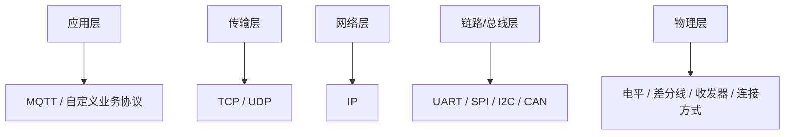
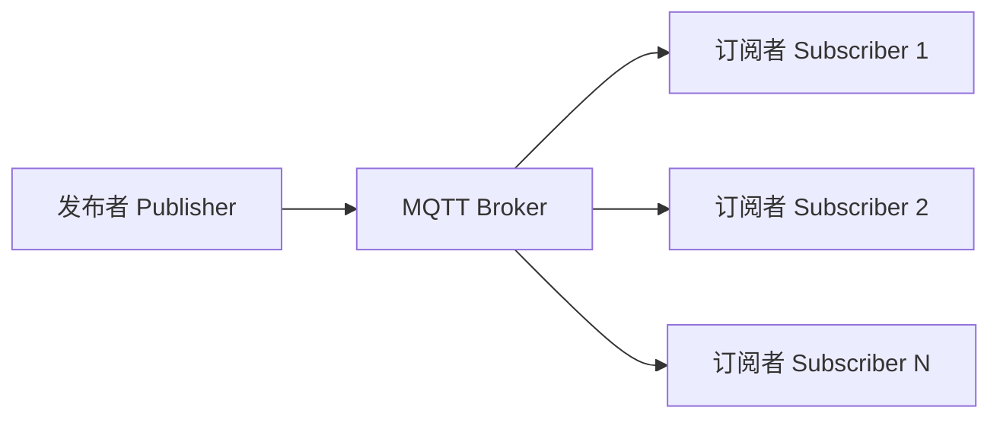

# 通信协议全部知识整理与面试问答

> 这份文件面向嵌入式面试准备。这里的“通信协议”默认覆盖：
> - 板内/板间常见串行通信：`UART`、`SPI`、`I2C`
> - 工业/车载常见总线：`CAN`、`RS-485`
> - 网络通信基础：`TCP / UDP / MQTT`
> - 协议选型、联调、排障和面试高频对比
>
> 回答结构默认统一为：
> 1. 先直接回答
> 2. 再展开解释
> 3. 最后补工程补充

## 1. 什么是通信协议

### 1.1 基本定义

通信协议，本质上就是**通信双方提前约定好的一套规则**。  
这套规则通常会规定：

- 数据怎么表示
- 什么时候开始传
- 什么时候结束
- 谁先发谁后发
- 出错怎么检测
- 多设备时怎么区分身份

一句话理解：

**协议就是让不同设备“按同一种语言和规则说话”。**

### 1.2 为什么需要协议

如果没有协议，即使两边电气连接已经打通，设备之间仍然可能出现：

- 不知道什么时候开始收数据
- 不知道一帧数据有多长
- 不知道收到的是地址、命令还是数据
- 出错了也不知道怎么判断

所以协议的核心价值是：

- 保证数据能被正确理解
- 保证通信有边界和顺序
- 保证系统可扩展、可联调、可排障

## 2. 通信协议可以怎么分类

### 2.1 按通信距离分

- **板内通信**
  例如 MCU 和传感器、Flash、显示驱动芯片之间
- **板间通信**
  例如主控板和从控板、控制板和功率板之间
- **网络通信**
  例如设备和上位机、网关、服务器之间

### 2.2 按传输方式分

- **并行通信**
  同时传多位，速度快，但线多
- **串行通信**
  一根或几根线按位传输，线少、应用广

嵌入式面试里最常见的重点通常是串行通信。

### 2.3 按时钟方式分

- **同步通信**
  收发双方共享时钟
  例如 `SPI`、部分 `I2C`
- **异步通信**
  不共享独立时钟，通过约定波特率和起止位完成同步
  例如 `UART`

### 2.4 按拓扑分

- 点对点
- 一主多从
- 多主多从
- 总线型

这会直接影响协议选型。

## 3. 通信协议常见层次理解

### 3.1 面试里为什么会问“协议分层”

因为很多协议并不在同一层。  
比如：

- `UART / SPI / I2C / CAN` 更偏底层总线或链路
- `TCP / UDP` 在传输层
- `MQTT` 在应用层

### 3.2 一个很稳的分层理解

#### 物理层

关注的是：

- 电平
- 线缆
- 连接方式
- 收发器

#### 数据链路层

关注的是：

- 帧格式
- 地址
- 校验
- 仲裁

#### 网络层

关注的是：

- 路由
- IP 地址

#### 传输层

关注的是：

- 端到端传输
- 是否可靠
- 是否重传

#### 应用层

关注的是：

- 业务语义
- 命令和数据的组织方式

### 3.3 面试里怎么说

**直接回答：**
通信协议可以按层来理解，底层更多解决“怎么传”，高层更多解决“传什么”和“怎么理解”。

**展开解释：**
像 `UART / SPI / I2C / CAN` 更多是总线和链路层面的规则；`TCP / UDP` 解决端到端传输；`MQTT` 则更偏应用层语义。

**工程补充：**
很多面试官问“MQTT 在哪一层”，真正就是在看你有没有分层意识。

### 3.4 图示：常见协议分层位置



## 4. UART

### 4.1 UART 是什么

`UART`，`Universal Asynchronous Receiver/Transmitter`，通用异步收发器。

它的特点是：

- 异步通信
- 通常只需要 `TX / RX`
- 可选 `GND`
- 有时还会有 `RTS / CTS`

### 4.2 UART 的核心特点

- 不共享时钟
- 通过波特率约定传输节奏
- 帧里通常有起始位、数据位、可选校验位、停止位

### 4.3 UART 帧格式

最常见的是：

- `1` 位起始位
- `8` 位数据位
- 可选校验位
- `1` 位或更多停止位

所以 `115200` 波特率发 1 字节，并不是只按 8 位算，而是要看完整帧。

### 4.5 公式：UART 有效吞吐怎么估算

如果是最常见的 `8N1`：

- `1` 位起始位
- `8` 位数据位
- `1` 位停止位

那么 1 字节通常对应 `10` 位传输开销。

可粗略估算：

`有效字节率 ≈ 波特率 / 10`

例如：

`115200 / 10 ≈ 11520 Byte/s`

### 4.4 UART 优缺点

#### 优点

- 简单
- 易调试
- 适合日志、CLI、与 PC 通信

#### 缺点

- 多设备扩展能力一般
- 没有像 `I2C`、`CAN` 那样天然地址和仲裁机制

## 5. SPI

### 5.1 SPI 是什么

`SPI`，`Serial Peripheral Interface`，串行外设接口。

它的典型信号有：

- `SCLK`
- `MOSI`
- `MISO`
- `CS / NSS`

### 5.2 SPI 的核心特点

- 同步通信
- 主从结构明显
- 通常全双工
- 速度快
- 没有标准的应答机制

### 5.3 SPI 优缺点

#### 优点

- 速度快
- 协议简单
- 适合高吞吐外设

#### 缺点

- 设备多时片选线会变多
- 没有天然地址机制
- 联调时对时钟、极性相位要很敏感

### 5.4 SPI 的模式

SPI 常见会提 `CPOL` 和 `CPHA`，也就是：

- 时钟空闲电平
- 数据采样边沿

不同组合形成常见的 `Mode0/1/2/3`。

## 6. I2C

### 6.1 I2C 是什么

`I2C`，`Inter-Integrated Circuit`。

典型信号只有两根：

- `SCL`
- `SDA`

### 6.2 I2C 的核心特点

- 同步通信
- 一主多从很常见
- 有设备地址
- 开漏输出
- 需要上拉电阻
- 半双工

### 6.3 I2C 的起始、停止、ACK/NACK

这是高频题。

#### 起始条件

`SCL` 为高时，`SDA` 从高变低。

#### 停止条件

`SCL` 为高时，`SDA` 从低变高。

#### ACK

接收方在规定时刻拉低应答位，表示收到了。

#### NACK

接收方不拉低，表示不应答或结束。

### 6.4 I2C 优缺点

#### 优点

- 线少
- 一条总线可挂多个器件
- 地址管理方便

#### 缺点

- 速度通常不如 SPI
- 总线负载大时更敏感
- 容易遇到拉低、卡死、仲裁等问题

## 7. CAN

### 7.1 CAN 是什么

`CAN`，`Controller Area Network`，控制器局域网络。

它的特点是：

- 多主总线
- 抗干扰能力强
- 仲裁机制成熟
- 广泛用于汽车和工业控制

### 7.2 CAN 的核心特点

- 基于报文 ID 仲裁
- 总线型结构
- 非破坏性仲裁
- 有较强的错误检测机制

### 7.3 为什么 CAN 适合车载和工业

因为它：

- 抗干扰强
- 多节点接入方便
- 实时性和可靠性较好
- 错误处理机制比较完善

### 7.4 CAN 的局限

- 带宽有限
- 报文负载不大
- 协议栈复杂度高于 UART / SPI / I2C

## 8. RS-485

### 8.1 RS-485 是什么

严格说，`RS-485` 更偏**物理层标准**，不是完整协议。  
它定义的是差分传输方式和电气特性。

### 8.2 RS-485 常和什么一起用

常和上层协议一起搭配，例如：

- Modbus RTU
- 自定义串口协议

### 8.3 RS-485 的核心优点

- 传输距离更远
- 抗干扰能力强
- 适合工业现场

## 9. TCP / UDP

### 9.1 TCP 是什么

`TCP` 是面向连接、可靠传输的传输层协议。

它的特点是：

- 有连接
- 有重传
- 有顺序保证
- 有流量控制和拥塞控制

### 9.2 UDP 是什么

`UDP` 是无连接、尽力而为的传输层协议。

它的特点是：

- 无连接
- 不保证可靠
- 开销小
- 时延低

### 9.3 TCP 和 UDP 的核心区别

#### TCP

- 更可靠
- 开销更大
- 时延更不稳定

#### UDP

- 更轻量
- 更快
- 但要自己承担更多可靠性管理

## 10. MQTT

### 10.1 MQTT 是什么

`MQTT` 是一种轻量级应用层消息协议，常用于物联网场景。

### 10.2 MQTT 的核心特点

- 基于发布/订阅模型
- 轻量
- 常跑在 `TCP` 之上
- 适合弱网和物联网设备

### 10.3 为什么 MQTT 常用于一对多

因为它通过 broker 做中转，天然适合：

- 一个设备发消息
- 多个订阅方接收

### 10.4 为什么不是广播就够了

广播虽然简单，但：

- 可控性差
- 不适合复杂系统管理
- 跨网络能力弱
- 可靠性和权限控制有限

而 MQTT 更适合业务解耦和系统扩展。

## 11. 自定义协议

### 11.1 什么是自定义协议

就是在底层通信接口之上，自己定义一套业务层数据格式。

常见会包含：

- 帧头
- 长度
- 命令字
- 负载
- 校验
- 帧尾

### 11.2 为什么要做自定义协议

因为底层接口只解决“字节怎么传”，不解决“业务怎么组织”。  
所以工程里常常需要在 `UART / CAN / TCP` 之上再封一层协议。

### 11.3 一个好协议通常关注什么

- 帧边界清晰
- 容易同步
- 容易扩展
- 有校验
- 有版本意识
- 排障方便

### 11.4 图示：自定义协议常见帧格式

```text
| 帧头 | 长度 | 命令字 | 负载数据 | 校验 | 帧尾 |
```

你可以把它理解成：

- 帧头：告诉你“这里是一帧开始”
- 长度：告诉你“这帧有多长”
- 命令字：告诉你“这是干什么的”
- 负载：真正业务内容
- 校验：判断有没有传错
- 帧尾：辅助做边界确认

### 11.5 图示：MQTT 发布/订阅模型



## 12. 常见协议对比

### 12.1 UART vs SPI vs I2C

#### UART

- 简单
- 异步
- 点对点常见

#### SPI

- 快
- 同步
- 全双工

#### I2C

- 线少
- 有地址
- 适合多设备挂载

### 12.2 CAN vs UART

#### CAN

- 更适合多节点
- 更抗干扰
- 仲裁和错误处理更强

#### UART

- 更简单
- 更适合点对点和调试链路

### 12.3 TCP vs UDP

#### TCP

- 可靠
- 复杂

#### UDP

- 轻量
- 时延低

### 12.4 SPI 为什么快，I2C 为什么更灵活

SPI 更快是因为协议简单、时钟直接、没有复杂应答和地址机制；  
I2C 更灵活是因为它有地址机制，一条总线可挂多个设备，省线。

## 13. 协议选型思路

### 13.1 选型时看什么

一般会看：

- 通信距离
- 速度要求
- 节点数量
- 抗干扰要求
- 是否需要可靠性
- 线数和成本
- 调试复杂度

### 13.2 一个常见选型思路

#### 板内高速外设

优先考虑 `SPI`

#### 板内多低速器件

优先考虑 `I2C`

#### 调试日志 / PC 联调

优先考虑 `UART`

#### 工业现场 / 远距离 / 强干扰

考虑 `RS-485` / `CAN`

#### 设备上云 / 局域网通信

考虑 `TCP / UDP / MQTT`

## 14. 通信协议常见问题与排障

### 14.1 通信失败先查什么

先分层看：

1. **物理层**
- 电源
- 接线
- 电平
- 上拉/终端电阻

2. **时序层**
- 波特率
- 时钟
- 极性相位
- 起始停止条件

3. **协议层**
- 地址
- 命令字
- 长度
- 校验

4. **软件层**
- 初始化顺序
- 中断/DMA
- 缓冲区管理

### 14.2 为什么协议排障一定要分层

因为很多问题根本不是“协议理解错了”，而是：

- 线接反了
- 波特率不一致
- 片选没拉对
- ACK 没收到

如果不分层，很容易一开始就陷进业务逻辑里。

### 14.3 常见工具

- 示波器
- 逻辑分析仪
- 串口助手
- 网络抓包工具

## 15. 通信协议面试高频问题与回答

### Q1. 什么是通信协议？

**直接回答：**
通信协议就是通信双方提前约定好的规则，用来规定数据怎么传、怎么解释、怎么判断是否正确。

**展开解释：**
它通常会规定帧格式、时序、地址、校验、应答方式等内容，没有这些规则，设备即使连上线也不一定能正确通信。

**工程补充：**
一句话记忆：
**协议是规则，不是线。**

### Q2. UART、SPI、I2C 的核心区别是什么？

**直接回答：**
UART 是异步点对点常见接口，SPI 是同步高速接口，I2C 是同步低线数、带地址的总线型接口。

**展开解释：**
UART 不带时钟，靠波特率同步；SPI 带时钟、速度快；I2C 线少、方便挂多个从设备。

**工程补充：**
这题属于嵌入式接口面试必问题。

### Q3. 为什么 UART 是异步通信？

**直接回答：**
因为 UART 收发双方不共享独立时钟线，而是靠事先约定好的波特率和起止位完成同步。

**展开解释：**
发送方和接收方都知道每一位持续多长时间，然后在约定时刻采样，所以不需要单独的时钟线。

**工程补充：**
面试里这题经常和波特率、起始位、停止位一起问。

### Q4. SPI 为什么比 I2C 快？

**直接回答：**
因为 SPI 协议更简单，时钟直接、没有地址和 ACK 这些额外开销。

**展开解释：**
SPI 通常是主从直连、高速同步移位；I2C 还要处理地址、起始停止、应答和总线管理，所以灵活但效率通常低一些。

**工程补充：**
这题很适合体现“速度”和“灵活性”的 trade-off。

### Q5. I2C 为什么要上拉电阻？

**直接回答：**
因为 I2C 的 `SDA` 和 `SCL` 通常是开漏结构，器件只能主动拉低，释放高电平要靠上拉电阻。

**展开解释：**
如果没有上拉，线被释放后就不能稳定回到高电平，总线状态会异常。

**工程补充：**
这是 I2C 高频基础题。

### Q6. I2C 的 ACK / NACK 是什么意思？

**直接回答：**
ACK 表示接收方应答成功，NACK 表示不应答或结束传输。

**展开解释：**
发送方发完一个字节后，接收方会在规定时钟周期上拉低或不拉低来表示状态。

**工程补充：**
面试里通常会继续问起始、停止条件。

### Q7. CAN 为什么适合车载？

**直接回答：**
因为 CAN 多主通信能力强、抗干扰好、仲裁和错误处理机制成熟，非常适合多节点控制系统。

**展开解释：**
车载系统节点多、干扰强、实时性和可靠性要求高，CAN 在这些方面比较均衡。

**工程补充：**
这题不要只答“因为行业常用”，要说出原因。

### Q8. TCP 和 UDP 的核心区别是什么？

**直接回答：**
TCP 可靠、面向连接，UDP 轻量、无连接。

**展开解释：**
TCP 提供重传、顺序保证、流控和拥塞控制；UDP 不保证这些，但开销小、时延低。

**工程补充：**
后面常会继续问：实时性更看重时会怎么选。

### Q9. MQTT 在哪一层？底层常用 TCP 还是 UDP？

**直接回答：**
MQTT 在应用层，底层通常跑在 TCP 之上。

**展开解释：**
MQTT 负责的是消息发布/订阅语义，不直接解决底层可靠传输问题，所以通常依赖 TCP。

**工程补充：**
这是非常高频的分层题。

### Q10. 为什么一对多通信有时不用广播，而选 MQTT？

**直接回答：**
因为 MQTT 的发布/订阅模型更适合业务解耦、权限管理和系统扩展，广播更适合简单场景。

**展开解释：**
广播虽然简单，但可控性弱、范围有限、管理能力差；MQTT 借助 broker 更适合复杂系统。

**工程补充：**
这题和你之前皮影机器人那类面试题很像。

### Q11. 什么时候会设计自定义协议？

**直接回答：**
当底层接口只能传字节，但业务上需要清晰的命令、长度、校验和扩展性时，就会设计自定义协议。

**展开解释：**
比如在 UART 上常会再封一层帧结构，区分命令、参数、状态和校验。

**工程补充：**
这题很适合结合你雷达项目里的 `TLV` 去讲。

### Q12. 一个自定义协议最重要的设计点是什么？

**直接回答：**
最重要的是帧边界清晰、字段语义明确、可校验、可扩展。

**展开解释：**
否则后面联调和版本迭代会很痛苦。

**工程补充：**
可以顺带说：长度字段、版本字段、校验字段通常都很重要。

### Q13. 串口通信不稳定，你先查什么？

**直接回答：**
我会先查物理连接、波特率配置和收发电平，再查帧格式和软件接收链路。

**展开解释：**
很多串口问题先不是代码 bug，而是：

- `TX/RX` 接反
- 波特率不一致
- 地没共地
- 校验位配置不一致

**工程补充：**
这题体现的是排障习惯。

### Q14. 为什么很多串口接收方案会用 DMA + 空闲中断？

**直接回答：**
因为它特别适合不定长数据接收，既减轻 CPU 负担，又能较好判断一帧结束。

**展开解释：**
DMA 负责搬数据，空闲中断负责判断“这段时间没再来字节，说明当前这一帧可能结束了”。

**工程补充：**
这是串口收包高频题。

### Q15. SPI / I2C / UART 你怎么选？

**直接回答：**
我会从速度、节点数量、线数成本、抗干扰和调试复杂度几个维度选。

**展开解释：**
高速外设优先 SPI，多低速器件优先 I2C，点对点调试和日志优先 UART。

**工程补充：**
这题非常适合用“场景驱动选型”来答。

### Q16. CAN 和 UART 相比最大的优势是什么？

**直接回答：**
CAN 最大的优势是更适合多节点总线和强干扰环境。

**展开解释：**
UART 更简单，但 CAN 在仲裁、抗干扰和错误处理方面更强，更适合复杂控制网络。

**工程补充：**
这题常见于车载和工业岗位。

### Q17. 为什么说 RS-485 不是完整协议？

**直接回答：**
因为 RS-485 更偏物理层电气标准，它定义的是差分传输方式，不定义上层报文语义。

**展开解释：**
真正的业务格式通常还要叠加像 Modbus RTU 或自定义协议。

**工程补充：**
这题答出“它是物理层标准”就很关键。

### Q18. 通信协议选型时你最先看什么？

**直接回答：**
我最先看的是速度、距离、节点数和可靠性要求。

**展开解释：**
因为这些条件基本决定了它更像是 UART、SPI、I2C、CAN，还是要走 TCP/UDP 这类网络方案。

**工程补充：**
这题不要只背接口名，要讲选型维度。

### Q19. 联调协议问题时为什么要分层排查？

**直接回答：**
因为很多问题根本不在业务协议层，而是在物理层或时序层。

**展开解释：**
如果不分层，很容易把接线、时钟、极性、地址这类问题误判成“代码逻辑错”。

**工程补充：**
这题很能体现工程排障能力。

### Q20. 你觉得通信协议面试里最重要的能力是什么？

**直接回答：**
我觉得最重要的不是背所有接口定义，而是能根据场景做选型、能讲清对比、还能分层排障。

**展开解释：**
协议本身很多，但面试官更想看的是你有没有工程判断，而不是只会背名词。

**工程补充：**
如果岗位偏嵌入式联调，这题答得工程化会很加分。

## 16. 通信协议面试继续追问问题清单

下面这些也是很常见的继续追问：

1. UART 为什么叫异步？
2. UART 一帧到底包含哪些位？
3. SPI 的 CPOL 和 CPHA 是什么？
4. I2C 为什么一定要上拉？
5. I2C 总线被拉死了怎么排查？
6. CAN 为什么可以多主仲裁？
7. RS-485 和 CAN 的差异是什么？
8. TCP 为什么可靠？
9. UDP 为什么更适合低时延场景？
10. MQTT 为什么常跑在 TCP 上？
11. 什么时候会自己封一层应用协议？
12. 协议里的校验字段怎么设计？
13. 为什么很多协议要带长度字段？
14. 帧头和帧尾分别解决什么问题？
15. 通信故障时你第一时间拿什么工具看？

## 17. 推荐复习顺序

如果你要快速准备通信协议面试，建议按这个顺序复习：

1. 什么是协议、为什么要分层
2. UART / SPI / I2C 的核心区别
3. CAN / RS-485 的典型场景
4. TCP / UDP / MQTT 的层次和差异
5. 自定义协议设计思路
6. 协议选型方法
7. 分层排障思路
8. 高频面试题 20 问

## 18. 一句话总总结

通信协议面试里最重要的不是把接口名背满，而是把下面这条链路讲顺：

**协议解决什么问题 -> 各类协议分别适合什么场景 -> 为什么这么选 -> 出问题时怎么分层排查**
