# 嵌入式八股图解手册

> 用途：把嵌入式八股从“背概念”改成“看结构、讲链路、答追问”。
>
> 每个知识点包含：面试抓手、Mermaid 图、图像生成提示词、常见追问。
>
> 推荐图像模板：`Infographic Engine / 信息图引擎`。适合技术图解、流程图、时序图、对比卡片和复习海报。

## 0. 总览：嵌入式八股知识地图

面试抓手：八股不是孤立知识点。多数题都能落到四层：C 语言与内存、MCU/RTOS 运行机制、外设通信链路、工程调试闭环。

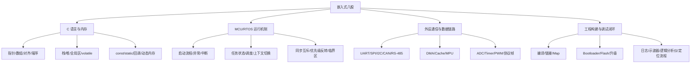

图像生成提示词：

```text
生成一张中文技术知识地图，主题为“嵌入式八股知识地图”。中心是“嵌入式八股”，向外分成四大模块：C 语言与内存、MCU/RTOS 运行机制、外设通信与数据链路、工程构建与调试闭环。每个模块下放 3 个短标签。16:9，信息图风格，层级清楚，文字必须清晰可读，不要长段文字。
```

常见追问：

- 你最熟的是哪一层？能否和项目对应起来？
- 如果只剩一天复习，优先看哪些图？
- 一个线上故障通常会跨越哪几层？

## 一、C 语言与内存

### 1. C 程序内存布局

面试抓手：要说清变量放哪里、生命周期多久、谁分配谁释放，以及嵌入式里为什么任务栈不能随便放大数组。

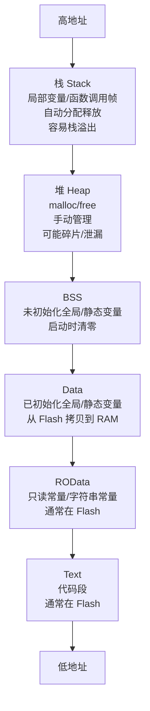

图像生成提示词：

```text
生成一张中文竖向内存布局图，主题为“C 程序内存布局”。从高地址到低地址展示 Stack、Heap、BSS、Data、ROData、Text。每层标注典型变量、生命周期、嵌入式风险。4:5，技术教育风格，颜色分区清楚，文字清晰。
```

常见追问：

- `static int a;` 和 `int a = 1;` 分别在哪里？
- 为什么大数组不要放任务栈？
- `const char *p = "abc"` 里的指针和字符串分别在哪里？

### 2. 数组名和指针

面试抓手：数组名在多数表达式里会退化成首元素指针，但数组本身不是指针；`sizeof(arr)` 和 `sizeof(p)` 是最常见区分点。

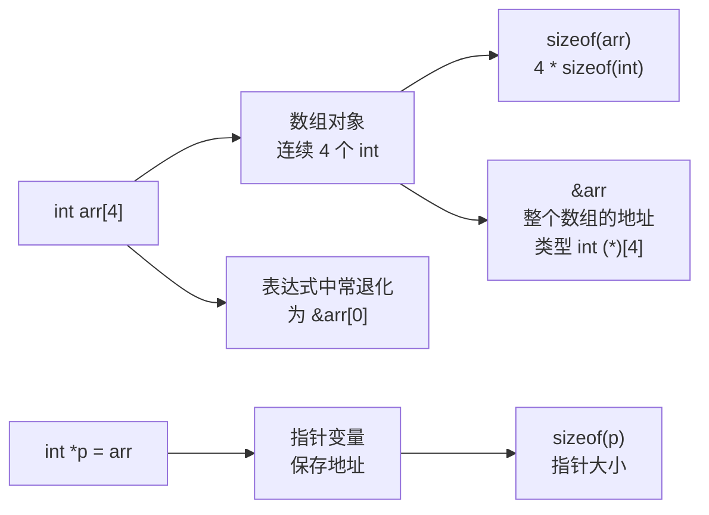

图像生成提示词：

```text
生成一张中文对比图，主题为“数组名和指针的区别”。左边画 int arr[4] 的连续内存格，右边画 int *p 指向 arr[0]。重点标注 sizeof(arr)、sizeof(p)、arr 退化、&arr 类型不同。横向 16:9，标签简短。
```

常见追问：

- 函数参数 `int arr[]` 为什么等价于 `int *arr`？
- `arr + 1` 和 `&arr + 1` 有什么区别？
- 字符数组和字符串指针有什么区别？

### 3. 结构体对齐与协议解析

面试抓手：结构体对齐是 CPU 访问效率和 ABI 规则问题；协议解析不能盲目把字节流强转成结构体。

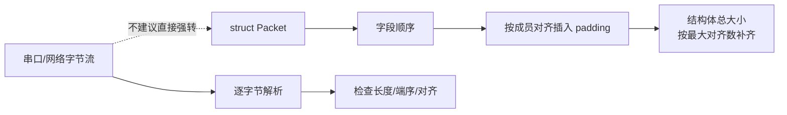

图像生成提示词：

```text
生成一张中文技术图解，主题为“结构体对齐与协议解析风险”。左边展示结构体字段和 padding，右边展示串口字节流逐字节解析。强调不要直接把字节流强转成结构体，要检查长度、端序、对齐。16:9，清晰专业。
```

常见追问：

- `#pragma pack(1)` 的代价是什么？
- 为什么结构体大小可能大于成员大小之和？
- 协议解析为什么要先判断长度？

### 4. 大端、小端与字段拼接

面试抓手：端序决定多字节数据在内存或协议里的高低字节顺序；通信协议必须明确字节序。

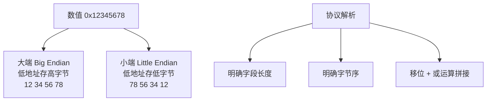

图像生成提示词：

```text
生成一张中文对比信息图，主题为“大端和小端”。用 0x12345678 展示 Big Endian 和 Little Endian 在地址递增方向上的存储顺序。下方补充协议解析步骤：字段长度、字节序、移位拼接。简洁清晰。
```

常见追问：

- MCU 常见是大端还是小端？
- 网络字节序是什么？
- 如何把两个字节合成 `uint16_t`？

### 5. `volatile` 的边界

面试抓手：`volatile` 防止编译器省略真实访问，但不保证原子性、不保证互斥、不解决 Cache 一致性。

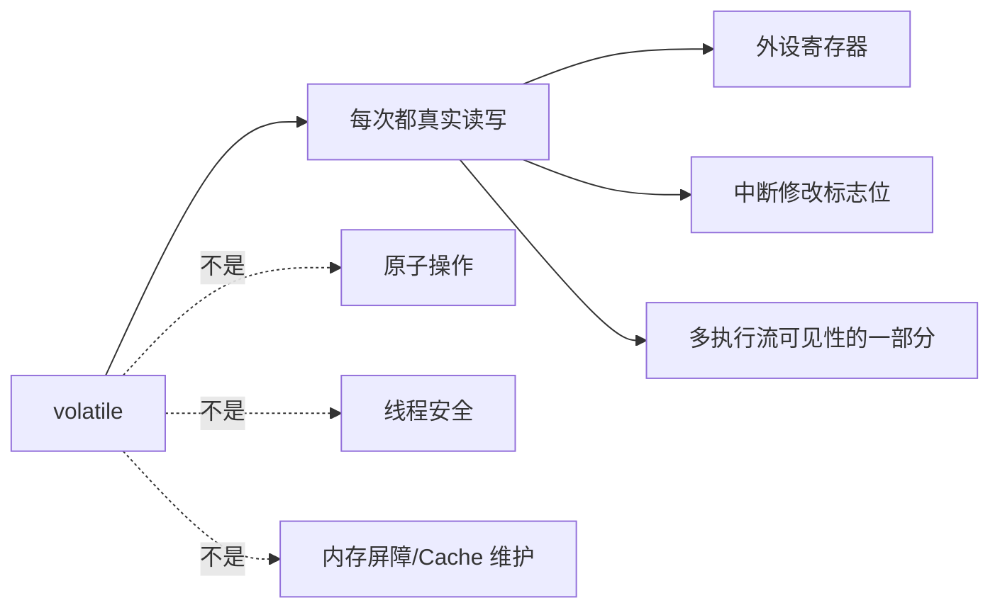

图像生成提示词：

```text
生成一张中文概念澄清图，主题为“volatile 能做什么，不能做什么”。左侧是能做：真实读写、外设寄存器、中断标志位；右侧是不能做：原子性、线程安全、Cache 一致性。使用对勾和叉号，文字清晰。
```

常见追问：

- 中断里改的标志位为什么常加 `volatile`？
- `volatile int count++` 是否原子？
- 多任务共享变量还需要什么保护？

### 6. `static`、`const`、作用域与生命周期

面试抓手：`static` 既可能改变生命周期，也可能限制链接可见性；`const` 表达只读约束，不等于一定放 Flash。

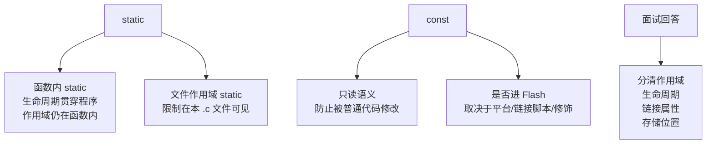

图像生成提示词：

```text
生成一张中文知识卡片，主题为“static 和 const 的区别”。分成 static 和 const 两栏，static 展示函数内静态变量、文件内可见性；const 展示只读语义和存储位置取决于平台。底部总结作用域、生命周期、链接属性、存储位置四个维度。
```

常见追问：

- 函数内 `static` 变量初始化几次？
- 头文件里定义 `static` 函数会怎样？
- `const` 指针和指向 `const` 的指针怎么读？

### 7. 动态内存与碎片

面试抓手：嵌入式谨慎用 `malloc/free`，核心风险是碎片、失败路径、实时性不可控和生命周期不清。

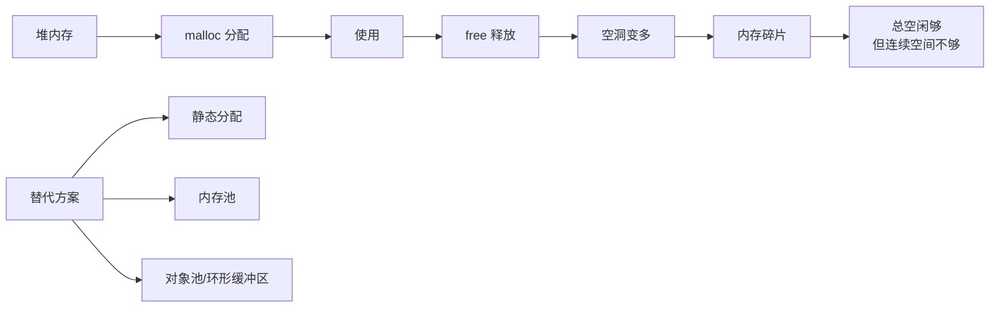

图像生成提示词：

```text
生成一张中文流程图，主题为“嵌入式动态内存碎片”。用内存块展示 malloc/free 后产生空洞，说明总空闲内存够但连续空间不够。右侧给出替代方案：静态分配、内存池、对象池、环形缓冲区。16:9，清晰。
```

常见追问：

- 为什么实时系统不喜欢频繁 `malloc`？
- 内存泄漏和内存碎片有什么区别？
- 内存池为什么更可控？

### 8. 函数指针、回调与驱动抽象

面试抓手：回调就是把“事件发生后做什么”交给上层注册，常用于中断、驱动、协议栈、状态机。

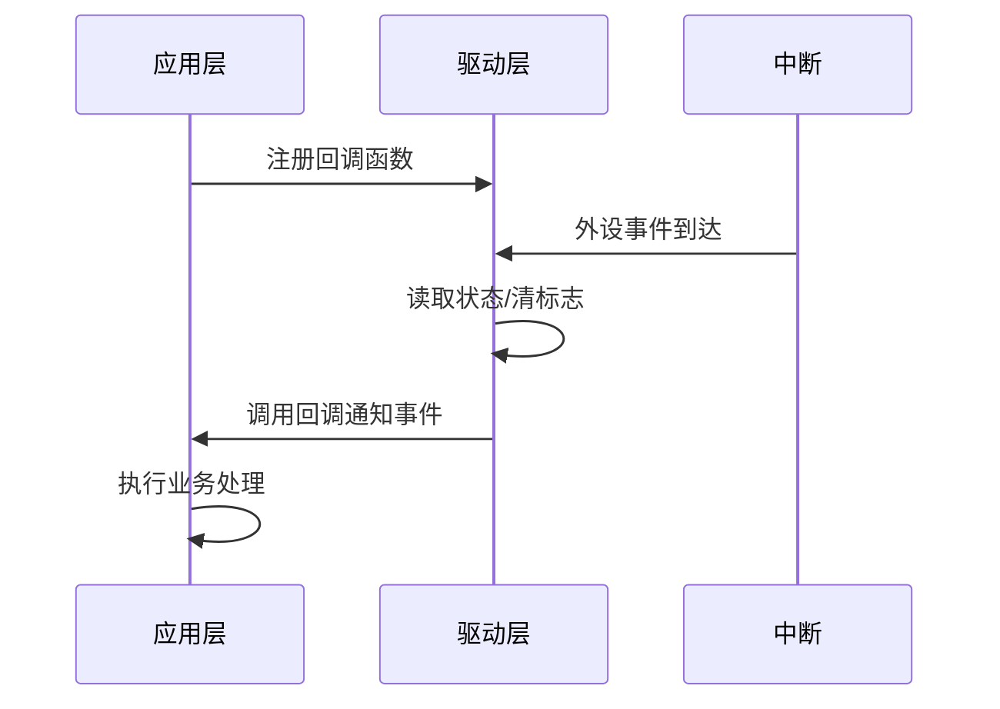

图像生成提示词：

```text
生成一张中文时序图，主题为“函数指针与回调在驱动中的作用”。展示应用层注册回调，外设中断到达，驱动清标志并调用应用回调。强调解耦、事件通知、不要在 ISR 中做重活。技术图解风格。
```

常见追问：

- 回调和轮询有什么区别？
- 回调函数里能不能阻塞？
- 为什么驱动层不直接写死业务逻辑？

## 二、编译、链接与启动

### 9. 编译到镜像文件

面试抓手：源码先变成目标文件，多个目标文件和库再链接成 ELF；嵌入式常从 ELF 提取 `bin/hex` 烧录。

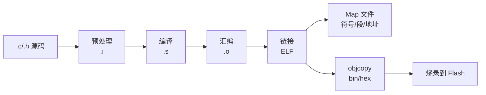

图像生成提示词：

```text
生成一张中文流程图，主题为“C 代码从源码到嵌入式镜像”。展示 .c/.h、预处理 .i、编译 .s、汇编 .o、链接 ELF、Map 文件、objcopy 生成 bin/hex、烧录 Flash。横向 16:9，箭头清楚。
```

常见追问：

- `.o` 文件里有什么？
- ELF 和 bin 有什么区别？
- Map 文件能看什么问题？

### 10. 链接脚本与段放置

面试抓手：链接脚本决定代码、常量、全局变量放到 Flash/RAM 的哪些地址；启动代码会把 `.data` 从 Flash 拷到 RAM，并清零 `.bss`。

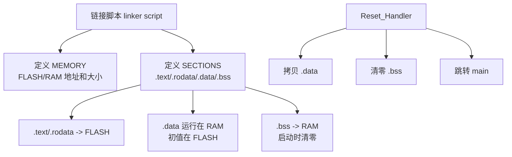

图像生成提示词：

```text
生成一张中文技术图解，主题为“链接脚本如何决定 Flash 和 RAM 布局”。左侧是 linker script，右侧分成 FLASH 和 RAM 两块，标注 .text/.rodata/.data/.bss。下方展示 Reset_Handler 拷贝 .data、清零 .bss、进入 main。文字清晰。
```

常见追问：

- `.data` 为什么既和 Flash 有关又和 RAM 有关？
- `.bss` 为什么不用占用固件文件里的实际数据？
- 栈和堆在哪里定义？

### 11. MCU 上电到 `main()`

面试抓手：上电后先从向量表取 MSP 初值和 Reset_Handler 地址，再初始化运行环境，最后进入 `main()`。

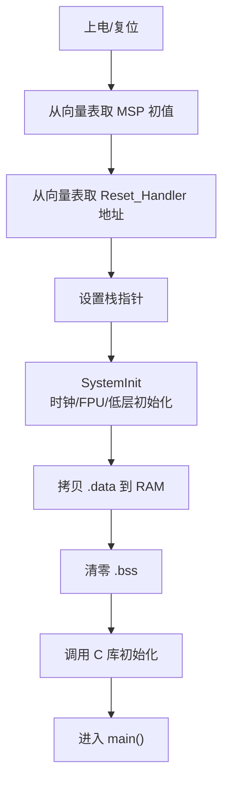

图像生成提示词：

```text
生成一张中文流程图，主题为“MCU 从上电复位到 main()”。按顺序展示取 MSP、取 Reset_Handler、设置栈、SystemInit、拷贝 .data、清零 .bss、C 库初始化、进入 main。适合 Cortex-M 面试复习，16:9，标签清楚。
```

常见追问：

- 向量表第 0 项和第 1 项分别是什么？
- `Reset_Handler` 做了什么？
- 为什么 `main()` 前全局变量已经可用？

### 12. 向量表与异常入口

面试抓手：向量表是异常/中断入口地址表；中断号对应表项，CPU 根据表项跳转到 ISR。

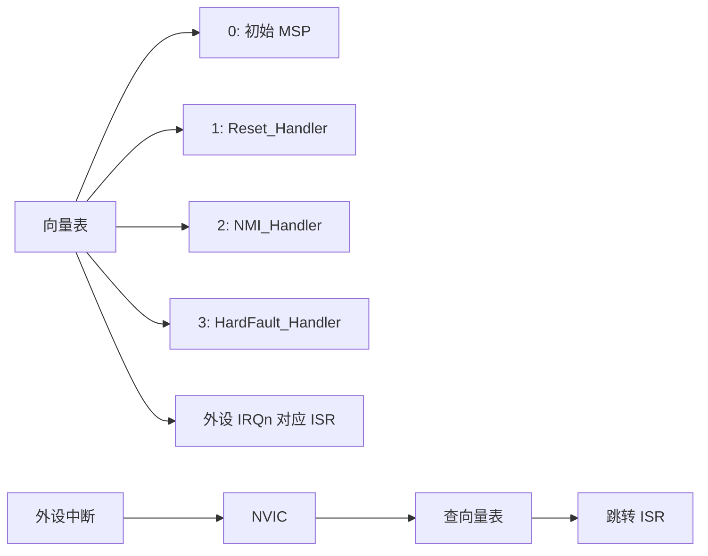

图像生成提示词：

```text
生成一张中文结构图，主题为“Cortex-M 向量表与中断入口”。左侧画向量表条目：MSP、Reset、NMI、HardFault、外设 IRQ；右侧画外设中断经过 NVIC 查表跳转 ISR。简洁、准确、适合面试。
```

常见追问：

- Bootloader 跳 App 时为什么要重设向量表？
- HardFault 入口在哪里？
- 中断优先级由谁管理？

## 三、RTOS、调度与并发

### 13. RTOS 任务状态机

面试抓手：任务通常在 Ready、Running、Blocked、Suspended 之间切换；调度器从 Ready 里选最高优先级任务运行。

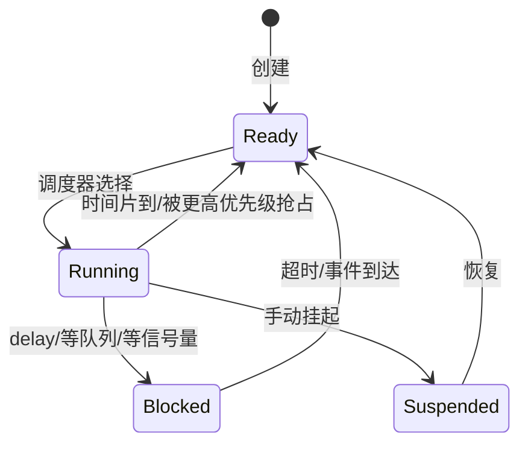

图像生成提示词：

```text
生成一张中文状态机图，主题为“RTOS 任务状态转换”。包含 Ready、Running、Blocked、Suspended，箭头标注创建、调度、抢占、等待事件、超时、挂起、恢复。强调 Ready 队列和最高优先级。清晰简洁。
```

常见追问：

- 阻塞态和挂起态有什么区别？
- 任务 `delay` 后去哪了？
- 为什么高优先级任务一就绪就能抢占？

### 14. 抢占式调度

面试抓手：抢占式 RTOS 的核心是“高优先级 Ready 任务优先运行”，时间片通常只在同优先级任务之间轮转。

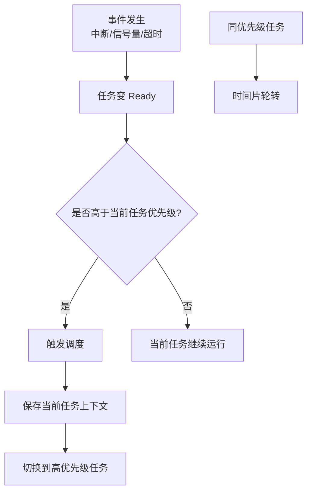

图像生成提示词：

```text
生成一张中文流程图，主题为“抢占式 RTOS 调度逻辑”。展示事件使任务 Ready，比较优先级，高优先级抢占当前任务，同优先级使用时间片轮转。使用判断节点和清晰箭头。16:9。
```

常见追问：

- 实时性和优先级有什么关系？
- 同优先级任务怎么运行？
- 低优先级任务会不会饿死？

### 15. SysTick、PendSV 与上下文切换

面试抓手：SysTick 提供系统节拍，PendSV 常用于延后执行上下文切换，避免在普通中断里直接切任务。

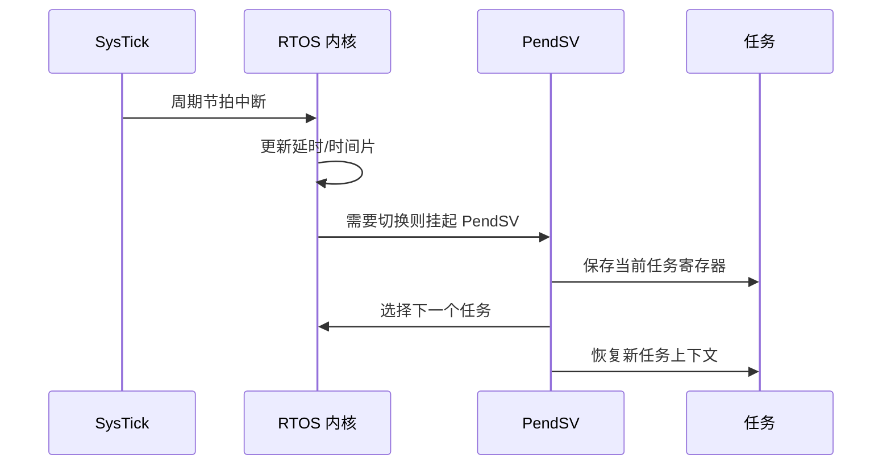

图像生成提示词：

```text
生成一张中文时序图，主题为“SysTick、PendSV 与 RTOS 上下文切换”。展示 SysTick 更新节拍，内核判断需要调度，挂起 PendSV，PendSV 保存当前任务上下文、选择新任务、恢复上下文。强调 PendSV 是低优先级延后切换机制。
```

常见追问：

- 为什么不用 SysTick 直接切任务？
- 上下文包含哪些寄存器？
- MSP 和 PSP 分别给谁用？

### 16. 信号量、互斥锁、队列、事件组

面试抓手：同步工具要按场景选。信号量偏通知/计数，互斥锁保护共享资源，队列传数据，事件组表达多个条件。

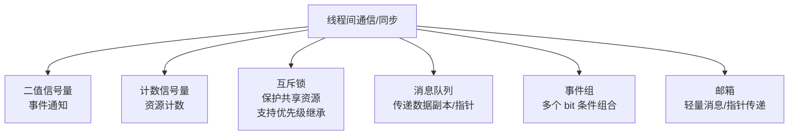

图像生成提示词：

```text
生成一张中文分类信息图，主题为“RTOS 常见同步与通信机制怎么选”。中心是线程间通信/同步，分支为二值信号量、计数信号量、互斥锁、消息队列、事件组、邮箱。每个分支写适用场景。16:9，模块化清晰。
```

常见追问：

- 信号量和互斥锁有什么区别？
- 队列传结构体还是传指针？
- ISR 里能不能用互斥锁？

### 17. 优先级反转与优先级继承

面试抓手：低优先级持锁，高优先级等锁，中优先级抢占低优先级，导致高优先级间接等待更久；互斥锁的优先级继承可缓解。

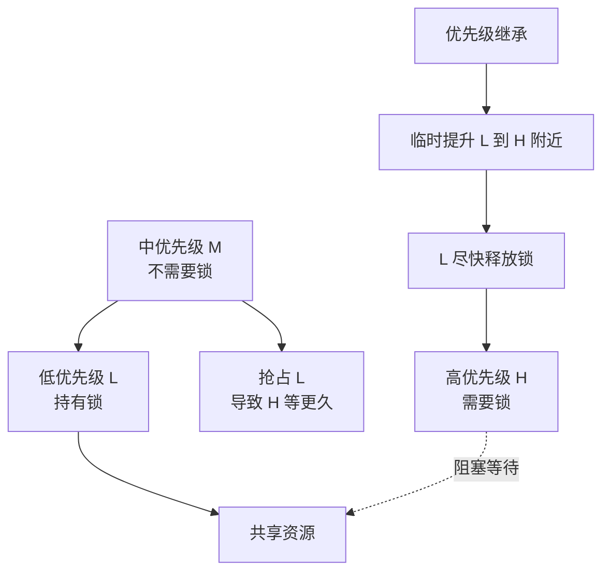

图像生成提示词：

```text
生成一张中文概念图，主题为“优先级反转与优先级继承”。展示 L 持锁、H 等锁、M 抢占 L 造成 H 间接被阻塞。再展示优先级继承临时提升 L，让 L 尽快释放锁。用红色表示问题路径，绿色表示解决路径。
```

常见追问：

- 信号量能否解决优先级反转？
- 优先级继承什么时候失效或不够？
- 如何减少锁持有时间？

### 18. 临界区、关中断与原子操作

面试抓手：保护共享资源有多种方式，选择取决于共享对象、执行上下文和实时性要求。

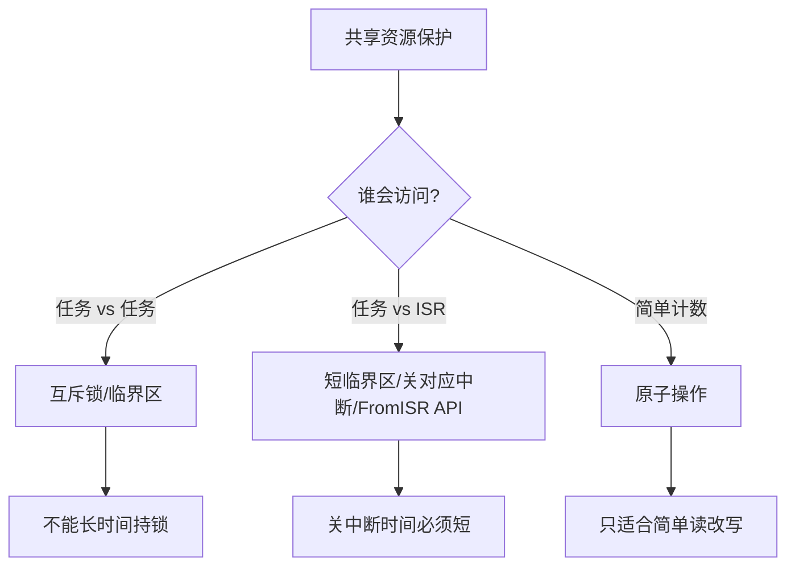

图像生成提示词：

```text
生成一张中文决策流程图，主题为“共享资源保护怎么选”。根据访问者分成任务对任务、任务对 ISR、简单计数三种情况，分别选择互斥锁/临界区、短暂关中断或 FromISR API、原子操作。强调关中断时间要短。清晰专业。
```

常见追问：

- 为什么 ISR 里不能拿普通互斥锁？
- 关全局中断有什么风险？
- `volatile` 和临界区是什么关系？

## 四、中断、DMA、Cache、MPU

### 19. 中断处理分层

面试抓手：ISR 做最小工作：读状态、清标志、搬必要数据、通知任务；复杂逻辑放任务。

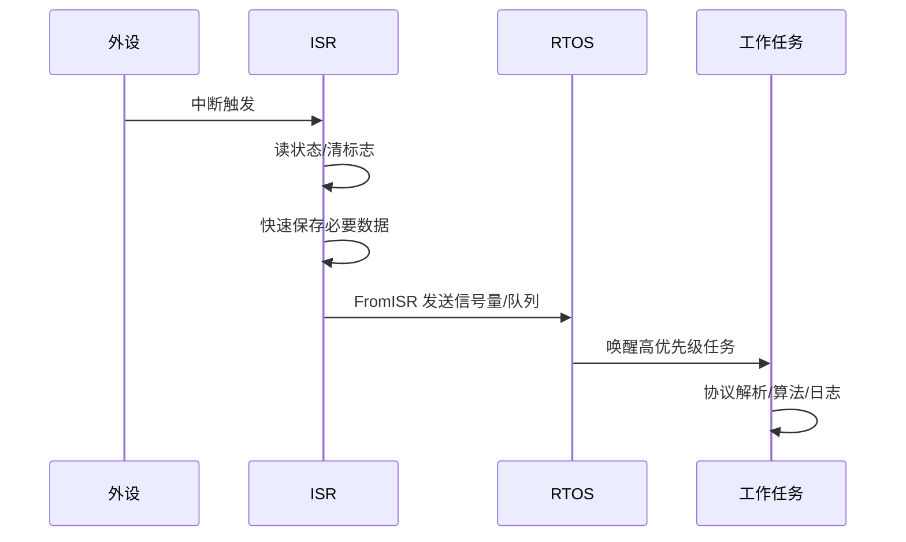

图像生成提示词：

```text
生成一张中文时序图，主题为“中断 ISR 与任务分层处理”。展示外设触发 ISR，ISR 读状态清标志、快速保存数据、通过 FromISR API 通知任务，任务执行复杂处理。突出 ISR 短、快、不阻塞。16:9。
```

常见追问：

- ISR 里为什么不能 `printf`？
- 中断标志为什么要及时清？
- FromISR API 和普通 API 有什么区别？

### 20. DMA 工作链路

面试抓手：DMA 的价值是让外设和内存之间搬运数据，减少 CPU 逐字节搬运和中断频率。

```mermaid
flowchart LR
    A["CPU 配置 DMA<br/>源/目的/长度/方向"] --> B["启动 DMA"]
    C["外设请求"] --> D["DMA 控制器搬运"]
    D --> E["RAM 缓冲区"]
    D --> F["半传输/传输完成中断"]
    F --> G["CPU 处理一批数据"]
```

图像生成提示词：

```text
生成一张中文技术流程图，主题为“DMA 的工作链路”。展示 CPU 配置 DMA、外设发起请求、DMA 控制器把数据搬到 RAM、半传输或完成中断通知 CPU 批量处理。突出减少 CPU 搬运。简洁清晰。
```

常见追问：

- DMA 是否完全不占总线？
- 半传输中断有什么用？
- DMA 适合小数据还是大批量数据？

### 21. DMA 与 D-Cache 一致性

面试抓手：DMA 直接访问 RAM，CPU 可能读写 D-Cache；双方看到的数据可能不一致，需要 Clean/Invalidate。

```mermaid
flowchart TB
    A["CPU"] <--> B["D-Cache"]
    B <--> C["RAM"]
    D["DMA"] <--> C
    E["外设"] <--> D
    F["CPU 写数据给 DMA 发送"] --> G["先 Clean<br/>把 Cache 写回 RAM"]
    H["DMA 接收数据给 CPU 读取"] --> I["后 Invalidate<br/>丢弃旧 Cache"]
```

图像生成提示词：

```text
生成一张中文图解，主题为“DMA 与 D-Cache 一致性”。画 CPU、D-Cache、RAM、DMA、外设的数据通路。标注 CPU 写给 DMA 前 Clean，DMA 写入后 CPU 读前 Invalidate。用红色提示旧数据风险。文字必须准确。
```

常见追问：

- Clean 和 Invalidate 分别什么时候用？
- 为什么加 `volatile` 不能解决 DMA Cache 问题？
- DMA buffer 为什么要对齐 Cache line？

### 22. Ping-Pong 双缓冲

面试抓手：双缓冲让 DMA 写一个缓冲区时，CPU 处理另一个缓冲区，减少丢数据风险。

```mermaid
sequenceDiagram
    participant DMA as DMA
    participant A as Buffer A
    participant B as Buffer B
    participant CPU as CPU

    DMA->>A: 写入第 1 批数据
    CPU->>B: 空闲/准备
    DMA->>B: 切换写入第 2 批数据
    CPU->>A: 处理第 1 批数据
    DMA->>A: 再切回写入
    CPU->>B: 处理第 2 批数据
```

图像生成提示词：

```text
生成一张中文时序图，主题为“DMA Ping-Pong 双缓冲”。展示 DMA 在 Buffer A 和 Buffer B 之间交替写入，CPU 同时处理另一个缓冲区。强调并行、降低丢包、适合 ADC/UART/音频采集。清晰专业。
```

常见追问：

- 双缓冲和环形缓冲有什么区别？
- CPU 处理太慢会怎样？
- 半传输中断如何配合双缓冲？

### 23. MPU 的作用

面试抓手：MPU 用区域权限限制错误访问，也可配置 Cache 属性；常用于保护任务栈、外设区、DMA buffer。

```mermaid
flowchart TB
    A["MPU"] --> B["按区域配置"]
    B --> C["起始地址/大小"]
    B --> D["读写/执行权限"]
    B --> E["Cache/Buffer 属性"]
    B --> F["特权/非特权访问"]
    G["典型用途"] --> H["栈溢出保护"]
    G --> I["外设区禁止执行"]
    G --> J["DMA buffer 配成非缓存"]
```

图像生成提示词：

```text
生成一张中文信息图，主题为“MPU 在嵌入式中的作用”。中心是 MPU，分支展示区域配置：地址、大小、权限、Cache 属性、特权级。下方展示用途：栈保护、外设区禁止执行、DMA buffer 非缓存。16:9。
```

常见追问：

- MPU 和 MMU 有什么区别？
- 为什么 DMA buffer 可能要配置成 non-cacheable？
- 访问非法地址会触发什么异常？

## 五、外设与通信协议

### 24. UART 帧格式与波特率

面试抓手：UART 1 字节通常不只 8 bit，还包含起始位、停止位、可选校验位；估算传输时间要按完整帧算。

```mermaid
flowchart LR
    A["空闲高电平"] --> B["Start<br/>1 bit"]
    B --> C["Data<br/>通常 8 bit"]
    C --> D["Parity<br/>可选"]
    D --> E["Stop<br/>1 或 2 bit"]
    F["115200 8N1"] --> G["1 字节约 10 bit"]
    G --> H["约 86.8 us/字节"]
```

图像生成提示词：

```text
生成一张中文 UART 帧格式图，主题为“为什么 UART 发 1 字节不能只按 8 bit 算”。展示空闲高电平、Start、8 bit Data、可选 Parity、Stop。下方标注 115200 8N1 一字节约 10 bit，约 86.8 us。时序图风格。
```

常见追问：

- `8N1` 是什么意思？
- 波特率和比特率一定相等吗？
- UART 乱码通常从哪些方向排查？

### 25. UART DMA + 空闲中断

面试抓手：DMA 解决搬运，空闲中断判断不定长帧结束，任务负责解析协议。

```mermaid
sequenceDiagram
    participant UART as UART
    participant DMA as DMA
    participant RAM as 环形/线性缓冲区
    participant ISR as IDLE ISR
    participant Task as 解析任务

    UART->>DMA: 字节连续到达
    DMA->>RAM: 自动写入缓冲区
    UART->>ISR: 总线空闲
    ISR->>ISR: 清 IDLE 标志/计算长度
    ISR->>Task: 通知一帧到达
    Task->>RAM: 校验帧头/长度/CRC
```

图像生成提示词：

```text
生成一张中文时序图，主题为“UART DMA + 空闲中断接收不定长帧”。展示 UART、DMA、缓冲区、IDLE ISR、解析任务。突出 DMA 搬运、空闲中断定帧、任务做协议校验。16:9。
```

常见追问：

- 空闲中断如何判断一帧结束？
- 如果连续两帧间隔很短会怎样？
- 环形缓冲区如何防止覆盖未处理数据？

### 26. SPI 通信链路

面试抓手：SPI 是全双工同步通信，主机提供时钟，常见问题是 CPOL/CPHA、片选、位序、时钟过快。

```mermaid
flowchart LR
    M["Master"] -->|SCLK| S["Slave"]
    M -->|MOSI| S
    S -->|MISO| M
    M -->|CS 片选| S
    A["配置关键点"] --> B["CPOL/CPHA"]
    A --> C["频率"]
    A --> D["MSB/LSB first"]
    A --> E["片选时序"]
```

图像生成提示词：

```text
生成一张中文 SPI 总线图，主题为“SPI 四线通信与常见配置”。画 Master 和 Slave，标注 SCLK、MOSI、MISO、CS。旁边列出 CPOL/CPHA、频率、位序、片选时序。技术图解风格。
```

常见追问：

- SPI 为什么是全双工？
- CPOL/CPHA 错了会有什么现象？
- 多从机如何片选？

### 27. I2C 读寄存器流程

面试抓手：典型读寄存器是先写寄存器地址，再重复起始读数据；I2C 问题常看 ACK、上拉、电平和时序。

```mermaid
flowchart LR
    A["Start"] --> B["Addr + W"]
    B --> C["ACK"]
    C --> D["Reg Addr"]
    D --> E["ACK"]
    E --> F["Repeated Start"]
    F --> G["Addr + R"]
    G --> H["ACK"]
    H --> I["Read Data"]
    I --> J["NACK"]
    J --> K["Stop"]
```

图像生成提示词：

```text
生成一张中文 I2C 读寄存器流程图。横向展示 Start、Addr+W、ACK、Reg Addr、ACK、Repeated Start、Addr+R、ACK、Read Data、NACK、Stop。补充小标签：开漏、上拉、7 位地址。文字清晰。
```

常见追问：

- 为什么读之前要先写寄存器地址？
- 没有 ACK 可能是什么原因？
- I2C 为什么需要上拉电阻？

### 28. CAN 帧与仲裁

面试抓手：CAN 是多主总线，显性位覆盖隐性位，ID 越小优先级越高；可靠性来自仲裁、CRC、ACK、错误处理。

```mermaid
flowchart TB
    A["CAN 总线"] --> B["多主竞争发送"]
    B --> C["逐位仲裁"]
    C --> D["显性位 0 覆盖隐性位 1"]
    D --> E["ID 小者优先级高"]
    A --> F["数据帧"]
    F --> G["ID"]
    F --> H["DLC"]
    F --> I["Data"]
    F --> J["CRC/ACK"]
```

图像生成提示词：

```text
生成一张中文 CAN 总线信息图，主题为“CAN 仲裁和数据帧”。展示多节点竞争发送、显性位覆盖隐性位、ID 越小优先级越高；同时展示数据帧字段 ID、DLC、Data、CRC、ACK。清晰、适合面试复习。
```

常见追问：

- CAN 为什么不会像 UART 那样简单冲突损坏？
- 标准帧和扩展帧区别？
- 终端电阻为什么重要？

### 29. RS-485 半双工

面试抓手：RS-485 是差分物理层，常见半双工，需要控制 DE/RE 方向，协议通常由上层定义。

```mermaid
flowchart LR
    A["MCU UART"] --> B["485 收发器"]
    B --> C["A/B 差分总线"]
    D["DE"] --> B
    E["RE"] --> B
    F["发送前"] --> G["拉高 DE"]
    H["发送完成"] --> I["等待移位寄存器空<br/>再切回接收"]
    I --> J["拉低 DE"]
```

图像生成提示词：

```text
生成一张中文 RS-485 半双工通信图。展示 MCU UART 连接 485 收发器，输出 A/B 差分总线，DE/RE 控制方向。重点标注发送前使能 DE，发送完成后等待最后一位发完再切回接收。16:9。
```

常见追问：

- RS-485 和 UART 是什么关系？
- 为什么要等发送完成再拉低 DE？
- 多节点总线如何避免同时发送？

### 30. ADC 采样链路

面试抓手：ADC 不是只调用一次函数，完整链路包括模拟前端、采样时间、触发源、DMA、滤波和标定。

```mermaid
flowchart LR
    A["传感器/模拟信号"] --> B["模拟前端<br/>分压/滤波/运放"]
    B --> C["ADC 采样保持"]
    C --> D["量化转换"]
    D --> E["DMA 搬运"]
    E --> F["数字滤波<br/>均值/中值/IIR"]
    F --> G["标定换算<br/>电压/温度/物理量"]
```

图像生成提示词：

```text
生成一张中文技术流程图，主题为“ADC 从模拟信号到物理量”。展示传感器、模拟前端、ADC 采样保持、量化转换、DMA、数字滤波、标定换算。标注采样时间、参考电压、分辨率。简洁专业。
```

常见追问：

- ADC 采样时间太短会怎样？
- 参考电压不稳有什么影响？
- 为什么要做滤波和标定？

### 31. Timer、PWM 与输入捕获

面试抓手：定时器本质是计数器加比较/捕获逻辑；PWM 看周期和占空比，输入捕获看边沿时间戳。

```mermaid
flowchart TB
    A["Timer 计数器"] --> B["向上/向下计数"]
    A --> C["预分频 PSC"]
    A --> D["自动重装 ARR"]
    A --> E["比较寄存器 CCR"]
    E --> F["PWM 输出<br/>占空比 = CCR/ARR"]
    A --> G["输入捕获<br/>记录边沿时间"]
    G --> H["测频率/脉宽"]
```

图像生成提示词：

```text
生成一张中文 Timer 信息图，主题为“定时器、PWM 和输入捕获”。展示 PSC、ARR、CCR 与计数器关系，标注 PWM 周期和占空比，输入捕获记录边沿时间用于测频率和脉宽。清晰可读。
```

常见追问：

- PWM 频率由什么决定？
- 占空比如何计算？
- 输入捕获如何测脉宽？

## 六、协议栈、网络与嵌入式 Linux

### 32. TCP/IP 分层与数据封装

面试抓手：应用数据逐层加头，发送时从应用层往下封装，接收时从链路层往上解封装。

```mermaid
flowchart TB
    A["应用层<br/>HTTP/MQTT/自定义协议"] --> B["传输层<br/>TCP/UDP"]
    B --> C["网络层<br/>IP"]
    C --> D["链路层<br/>Ethernet/Wi-Fi"]
    D --> E["物理层"]
    F["发送"] --> G["逐层加头"]
    H["接收"] --> I["逐层去头"]
```

图像生成提示词：

```text
生成一张中文 TCP/IP 分层信息图。展示应用层、传输层、网络层、链路层、物理层，以及发送逐层加头、接收逐层去头。列出 HTTP/MQTT、TCP/UDP、IP、Ethernet/Wi-Fi 示例。简洁清晰。
```

常见追问：

- TCP 和 UDP 在哪一层？
- MQTT 基于 TCP 还是 UDP？
- 打开网页大概经过哪些步骤？

### 33. TCP 三次握手与四次挥手

面试抓手：三次握手确认双方收发能力和初始序列号；四次挥手是因为 TCP 双向连接要分别关闭。

```mermaid
sequenceDiagram
    participant C as Client
    participant S as Server
    C->>S: SYN
    S->>C: SYN + ACK
    C->>S: ACK
    C->>S: FIN
    S->>C: ACK
    S->>C: FIN
    C->>S: ACK
```

图像生成提示词：

```text
生成一张中文 TCP 时序图，主题为“三次握手与四次挥手”。上半部分展示 SYN、SYN+ACK、ACK；下半部分展示 FIN、ACK、FIN、ACK。标注握手用于建立连接和同步序列号，挥手用于双向关闭。简洁。
```

常见追问：

- 为什么不是两次握手？
- 为什么挥手通常是四次？
- `TIME_WAIT` 有什么作用？

### 34. Linux 用户态到驱动访问链路

面试抓手：嵌入式 Linux 里应用通常通过设备文件访问内核驱动，驱动再操作硬件寄存器或总线。

```mermaid
flowchart TB
    A["用户态 App"] --> B["open/read/write/ioctl"]
    B --> C["/dev/xxx 设备文件"]
    C --> D["VFS"]
    D --> E["字符设备驱动"]
    E --> F["总线/寄存器/I2C/SPI"]
    F --> G["硬件设备"]
```

图像生成提示词：

```text
生成一张中文嵌入式 Linux 访问链路图。展示用户态 App 通过 open/read/write/ioctl 访问 /dev/xxx，经过 VFS 到字符设备驱动，再访问寄存器、I2C、SPI 或硬件设备。16:9，层次清楚。
```

常见追问：

- 字符设备和块设备区别？
- `ioctl` 适合做什么？
- 用户态为什么不能随便直接访问硬件寄存器？

## 七、Bootloader、Flash 与升级

### 35. Flash 分区与双 App

面试抓手：安全升级通常要有 Bootloader、App A/App B、参数区和升级标志，关键是失败可回滚。

```mermaid
flowchart TB
    A["Flash 布局"] --> B["Bootloader<br/>固定入口"]
    A --> C["App A<br/>当前运行"]
    A --> D["App B<br/>下载新固件"]
    A --> E["Param/Flag<br/>版本/状态/回滚标志"]
    A --> F["Factory/Backup<br/>可选出厂镜像"]
```

图像生成提示词：

```text
生成一张中文 Flash 分区示意图，主题为“Bootloader 双 App 升级布局”。从低地址到高地址画 Bootloader、App A、App B、Param/Flag、Factory/Backup。标注当前运行区、新固件下载区、升级标志、回滚能力。清晰。
```

常见追问：

- 为什么 Bootloader 不能轻易被覆盖？
- 单 App 升级和双 App 升级区别？
- 升级标志掉电时如何保证一致？

### 36. 安全升级状态机

面试抓手：升级不是简单写 Flash，要经历下载、校验、切换、试运行、确认或回滚。

```mermaid
stateDiagram-v2
    [*] --> Idle: 正常运行
    Idle --> Downloading: 收到升级命令
    Downloading --> Verifying: 下载完成
    Verifying --> PendingBoot: CRC/签名通过
    Verifying --> Idle: 校验失败
    PendingBoot --> TrialRun: 重启进入新 App
    TrialRun --> Confirmed: 自检成功
    TrialRun --> Rollback: 自检失败/超时
    Rollback --> Idle: 回到旧 App
```

图像生成提示词：

```text
生成一张中文状态机图，主题为“嵌入式安全升级状态机”。包含 Idle、Downloading、Verifying、PendingBoot、TrialRun、Confirmed、Rollback。标注下载、校验、试运行、确认、失败回滚。技术信息图风格。
```

常见追问：

- 升级过程中掉电怎么办？
- CRC 和签名分别解决什么？
- 新 App 如何告诉 Bootloader 自检成功？

### 37. Bootloader 跳转 App

面试抓手：跳转 App 前要关闭中断、设置 MSP、重定位向量表、跳转 Reset_Handler，否则中断和栈可能错乱。

```mermaid
flowchart TD
    A["Bootloader 准备跳 App"] --> B["关闭全局中断/外设中断"]
    B --> C["检查 App 栈顶地址合法"]
    C --> D["读取 App Reset_Handler"]
    D --> E["设置 VTOR 指向 App 向量表"]
    E --> F["设置 MSP 为 App 初始栈"]
    F --> G["跳转 App Reset_Handler"]
```

图像生成提示词：

```text
生成一张中文流程图，主题为“Bootloader 跳转 App 的关键步骤”。展示关闭中断、检查栈顶地址、读取 Reset_Handler、设置 VTOR、设置 MSP、跳转 App Reset_Handler。强调向量表和栈。16:9。
```

常见追问：

- 为什么要设置 VTOR？
- 为什么要检查 App 栈顶地址？
- 跳转前外设是否要反初始化？

## 八、故障定位与工程调试

### 38. 新板 bring-up 流程

面试抓手：新板调试要从电源、时钟、复位、下载、串口日志、最小外设逐步推进，不要一上来跑完整业务。

```mermaid
flowchart TD
    A["新板上电"] --> B["检查电源轨<br/>电压/纹波/电流"]
    B --> C["检查复位/BOOT 引脚"]
    C --> D["确认时钟<br/>晶振/PLL"]
    D --> E["下载最小程序"]
    E --> F["点灯/串口日志"]
    F --> G["逐个外设 bring-up"]
    G --> H["集成业务"]
```

图像生成提示词：

```text
生成一张中文工程流程图，主题为“新板 bring-up 调试顺序”。从上电开始，依次检查电源、复位/BOOT、时钟、下载最小程序、点灯/串口日志、逐个外设、集成业务。风格务实清晰，适合面试答题。
```

常见追问：

- 板子无反应你先看什么？
- 为什么先跑最小程序？
- 如何判断是硬件问题还是软件配置问题？

### 39. HardFault 定位流程

面试抓手：HardFault 不要只说“看堆栈”，要说清保存现场、取异常栈帧、看 PC/LR/xPSR、查反汇编和访问地址。

```mermaid
flowchart TD
    A["进入 HardFault"] --> B["判断使用 MSP 还是 PSP"]
    B --> C["读取异常栈帧<br/>R0-R3/R12/LR/PC/xPSR"]
    C --> D["定位 PC 附近反汇编"]
    D --> E["查看 CFSR/HFSR/BFAR/MMFAR"]
    E --> F{"常见原因"}
    F --> G["空指针/野指针"]
    F --> H["栈溢出"]
    F --> I["非法访问/未对齐访问"]
    F --> J["中断优先级/API 使用错误"]
```

图像生成提示词：

```text
生成一张中文故障定位流程图，主题为“HardFault 排查流程”。展示进入 HardFault、判断 MSP/PSP、读取异常栈帧、定位 PC 反汇编、查看 CFSR/HFSR/BFAR/MMFAR、归因到空指针、栈溢出、非法访问、未对齐访问、中断优先级错误。清晰专业。
```

常见追问：

- 如何从栈帧找到出错指令？
- `LR = 0xFFFFFFFD` 代表什么含义方向？
- 栈溢出为什么可能表现为 HardFault？

### 40. 通信异常排查总流程

面试抓手：通信问题按物理层、配置层、协议层、业务层逐层排查，用示波器/逻辑分析仪验证事实。

```mermaid
flowchart TD
    A["通信异常"] --> B["物理层<br/>电平/接线/上拉/终端电阻"]
    B --> C["时序层<br/>波特率/时钟/CPOL/CPHA"]
    C --> D["驱动层<br/>中断/DMA/错误标志"]
    D --> E["协议层<br/>帧头/长度/CRC/端序"]
    E --> F["业务层<br/>状态机/超时/重试"]
    G["工具"] --> H["示波器"]
    G --> I["逻辑分析仪"]
    G --> J["日志/计数器"]
```

图像生成提示词：

```text
生成一张中文排查流程图，主题为“嵌入式通信异常如何分层排查”。从物理层、时序层、驱动层、协议层、业务层逐层展开，旁边列出示波器、逻辑分析仪、日志计数器。适合 UART/I2C/SPI/CAN 通用排查。
```

常见追问：

- UART 乱码怎么排查？
- I2C 无 ACK 怎么排查？
- SPI 读回全 0 或全 FF 可能是什么？

### 41. 寄存器读写异常排查

面试抓手：寄存器值不对，不要只怀疑代码；还要看时钟、复位、地址、权限、总线、时序、读写位属性。

```mermaid
flowchart TD
    A["寄存器读写异常"] --> B["外设时钟是否打开"]
    B --> C["外设是否解除复位"]
    C --> D["基地址/偏移是否正确"]
    D --> E["读写权限是否允许"]
    E --> F["位是否 W1C/只读/保留位"]
    F --> G["是否需要等待状态位"]
    G --> H["用调试器/日志/波形验证"]
```

图像生成提示词：

```text
生成一张中文流程图，主题为“寄存器读写异常排查”。依次检查外设时钟、复位、基地址偏移、读写权限、W1C/只读/保留位、等待状态位、用调试器和波形验证。风格清晰，适合嵌入式面试。
```

常见追问：

- 什么是 W1C 位？
- 为什么写了寄存器但没有效果？
- 读状态位为什么要加超时？

### 42. 看门狗与复位原因

面试抓手：看门狗是故障恢复机制，不是掩盖 bug；复位后要记录原因，定位是独立看门狗、窗口看门狗、软件复位还是掉电复位。

```mermaid
flowchart TB
    A["系统运行"] --> B["周期喂狗"]
    B --> C{"任务卡死/死循环?"}
    C -- "否" --> A
    C -- "是" --> D["未按时喂狗"]
    D --> E["看门狗复位"]
    E --> F["启动后读取复位原因"]
    F --> G["记录日志/计数"]
    G --> H["定位卡死模块"]
```

图像生成提示词：

```text
生成一张中文流程图，主题为“看门狗与复位原因定位”。展示系统运行、周期喂狗、任务卡死、未按时喂狗、看门狗复位、启动后读取复位原因、记录日志、定位模块。强调看门狗是恢复机制，不是替代问题定位。清晰。
```

常见追问：

- 独立看门狗和窗口看门狗区别？
- 多任务系统如何设计喂狗？
- 为什么复位原因寄存器要尽早读取？

## 九、项目表达桥接图

### 43. 八股到项目回答模板

面试抓手：回答八股时，最后补一句项目落点，比纯概念更像真实做过。

```mermaid
flowchart LR
    A["八股概念"] --> B["机制解释"]
    B --> C["风险/边界"]
    C --> D["工程做法"]
    D --> E["项目例子"]
    E --> F["结果/验证"]
```

图像生成提示词：

```text
生成一张中文回答模板图，主题为“嵌入式八股如何讲到项目”。从八股概念到机制解释、风险边界、工程做法、项目例子、结果验证。每个节点用简短文字，适合面试复盘卡片。16:9。
```

常见追问：

- 你项目里哪里用到了这个机制？
- 你怎么验证这个设计是对的？
- 如果重做会怎么改？

### 44. 故障回答模板

面试抓手：故障题要按“现象、复现、隔离、定位、修复、验证、预防”讲，体现工程闭环。

```mermaid
flowchart LR
    A["现象"] --> B["复现条件"]
    B --> C["分层隔离"]
    C --> D["证据采集<br/>日志/波形/寄存器"]
    D --> E["定位根因"]
    E --> F["修复方案"]
    F --> G["验证结果"]
    G --> H["预防措施"]
```

图像生成提示词：

```text
生成一张中文面试答题流程图，主题为“嵌入式故障排查回答模板”。从现象、复现条件、分层隔离、证据采集、定位根因、修复方案、验证结果、预防措施依次展开。风格清晰、工程化、适合面试准备。
```

常见追问：

- 你当时怎么证明根因不是别的问题？
- 修复后如何验证没有引入新问题？
- 有没有沉淀成检查项或自动化测试？

