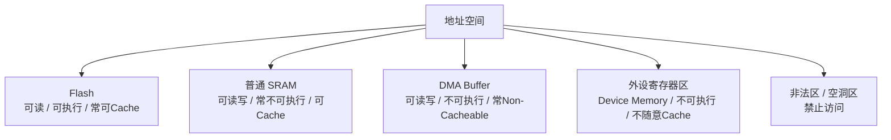
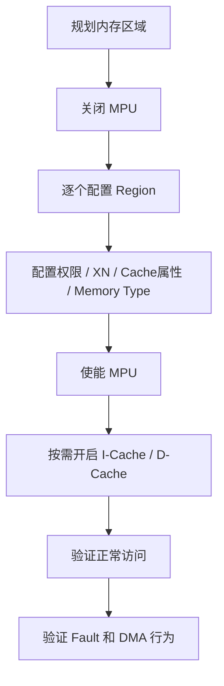

# MPU 全部知识整理与面试问答

> 这份文件面向嵌入式面试准备，这里的 `MPU` 默认指 `Memory Protection Unit`，也就是内存保护单元。
> 回答结构默认统一为：
> 1. 先直接回答
> 2. 再展开解释
> 3. 最后补工程补充

## 1. MPU 是什么

### 1.1 基本定义

MPU，`Memory Protection Unit`，内存保护单元。  
它的核心作用是：

- 给不同地址区域设置访问权限
- 控制某块内存能不能执行代码
- 控制某块内存能不能被缓存
- 帮系统在访问异常时尽早发现问题

一句话理解：

**MPU 不是用来“存数据”的，而是用来“管理这块内存该怎么被访问”。**

### 1.2 为什么 MCU 需要 MPU

很多人一开始会觉得：

- MCU 内存本来就不大
- 地址空间也没那么复杂
- 为什么还要做内存保护

原因是，只要系统稍微复杂一点，就会遇到这些问题：

- 程序误写到不该写的地址
- 任务越界访问别人的内存
- 外设寄存器区域被当普通内存乱操作
- DMA 缓冲区和 Cache 一起用时出现数据不一致
- 某块 SRAM 被错误当成代码执行

MPU 的价值就是：

**让内存访问“有规则”，而不是所有地址都默认随便读写执行。**

## 2. MPU 和 MMU 的区别

### 2.1 核心区别

#### MPU

- 主要做内存区域保护和属性管理
- 不做复杂虚拟地址转换
- 结构更轻量
- 很适合 `Cortex-M` 这类 MCU

#### MMU

- `Memory Management Unit`
- 除了权限控制，还支持虚拟内存、地址映射、页表机制
- 更常见于 Linux、A 类处理器、应用处理器

### 2.2 面试里怎么说

**直接回答：**
MPU 更像“区域级保护和属性管理”，MMU 更像“完整的内存管理和地址转换系统”。

**展开解释：**
MPU 一般按 region 来管，强调某一块地址是否可读、可写、可执行，以及是不是 cacheable；MMU 则能做虚拟地址到物理地址的映射，支持分页、进程隔离等更复杂的机制。

**工程补充：**
在 MCU 场景里，如果面试官问 MPU，通常默认就是 `Cortex-M` 方向，不要把重点带到 Linux 页表上去。

## 3. MPU 能解决什么问题

### 3.1 防止非法访问

可以把某块内存设成：

- 只读
- 不可写
- 不可执行
- 特权可访问、非特权不可访问

这样程序一旦访问错了，系统会更快报错，而不是悄悄把数据写坏。

### 3.2 防止错误执行

比如：

- SRAM 用来放数据
- 外设寄存器区用来做控制

这两块通常都不应该被执行。  
这时可以把它们设成 `XN`，也就是 `Execute Never`。

### 3.3 管理 Cache 行为

在 `Cortex-M7 / H7` 这类带 D-Cache / I-Cache 的平台上，MPU 很重要。  
因为不同内存区域可能要设置成：

- cacheable
- non-cacheable
- bufferable
- shareable

如果这部分没配好，DMA 和 CPU 看到的数据就可能不一致。

### 3.4 提高系统可调试性

如果没有 MPU：

- 越界写内存可能不会立刻暴露
- 只有很后面系统崩了，你才发现有问题

如果有 MPU：

- 一访问非法区域就触发 `MemManage Fault`
- 更容易定位问题

## 4. MPU 的核心概念

## 4.1 Region

MPU 通常按“区域”来管理内存。  
每个 region 一般会配置：

- 基地址
- 大小
- 访问权限
- 是否可执行
- cache/buffer/share 属性

一句话理解：

**MPU 不是按一个一个字节配，而是按一大片地址区域配。**

### 4.2 地址对齐和区域大小

很多 `Cortex-M` MPU 的 region 都要求：

- 区域大小通常是 `2` 的幂
- 基地址要按区域大小对齐

例如：

- 32B
- 64B
- 128B
- 256B
- 1KB
- 4KB
- 32KB
- 1MB

如果你配了一个 4KB region，那么基地址通常也要按 4KB 对齐。

### 4.3 Subregion

有些 MPU 支持把一个大 region 再切成若干子区域，方便屏蔽其中一部分。  
这样你不必为了一个小洞单独拆非常多 region。

### 4.4 Region 优先级和重叠

不同架构具体规则略有区别，但常见思路是：

- region 之间允许重叠
- 优先级更高的 region 会覆盖优先级更低的配置

面试里最稳的说法是：

**重叠 region 最终生效的一般是优先级更高的那一个。**

### 4.5 Background Region

有些系统在使能 MPU 后，还允许保留默认内存映射作为背景规则。  
例如只对特定 region 做精细保护，其他区域仍按默认属性处理。

这类行为通常由使能 MPU 时的配置位决定。

## 5. MPU 常见属性

### 5.1 访问权限

常见有：

- 可读可写
- 只读
- 特权读写、非特权只读
- 特权可访问、非特权不可访问

### 5.2 可执行属性

最常见的是：

- executable
- `XN`，`Execute Never`

典型做法：

- Flash 可执行
- SRAM 通常不可执行
- 外设区不可执行

### 5.3 Cacheable

表示这块内存是否允许被 cache。  
普通代码区、普通 SRAM 往往可以 cache；DMA 缓冲区、某些共享内存区往往不能随便 cache。

### 5.4 Bufferable

表示写操作是否允许进入写缓冲。  
这和写入时序、性能表现有关。

### 5.5 Shareable

表示这块内存是不是“共享可见”的语义区域。  
在简单 MCU 场景里，大家最常见的工程理解是：

- 共享区域要更谨慎对待 cache 一致性
- 和 DMA/总线主设备协同相关

### 5.6 Normal Memory / Device Memory

这也是很高频的点。

#### Normal Memory

更适合普通代码和数据访问：

- 可预测性更偏向普通内存
- 常常可 cache
- 可以有更高的访问效率

#### Device Memory

更适合外设寄存器区域：

- 不应该像普通 SRAM 那样被随意缓存
- 访问顺序和副作用更重要

一句话理解：

**普通数据区按 normal memory 管，寄存器区按 device memory 管。**

## 6. Cortex-M 里 MPU 的典型区域规划

下面是非常常见的一套思路：

### 6.1 Flash

- 可读
- 一般不可写
- 可执行
- 常可 cache

### 6.2 普通 SRAM

- 可读可写
- 一般不可执行
- 可 cache

### 6.3 DMA 缓冲区

- 可读可写
- 不可执行
- 往往设为 non-cacheable

### 6.4 外设寄存器区

- 可读可写
- 不可执行
- 通常是 device memory
- 一般不可 cache

### 6.5 空洞区 / 非法区

- 直接禁止访问
- 用于尽早抓非法指针或空指针访问

### 6.6 图示：典型 MPU 区域规划

## 7. MPU 和 Cache、DMA 的关系

### 7.1 为什么带 Cache 的 MCU 特别强调 MPU

因为一旦有 D-Cache，CPU 读写的数据不一定立刻落到真实内存里。  
这时如果 DMA 也在访问同一块内存，就可能出现：

- CPU 看的是 cache 里的旧数据
- DMA 看的是 SRAM 里的新数据
- 或者反过来

这就会导致数据不一致。

### 7.2 为什么 DMA 缓冲区常设成 non-cacheable

**直接回答：**
因为 DMA 不会自动和 CPU 的 cache 做一致性同步，所以把 DMA 缓冲区设成 non-cacheable 最省心。

**展开解释：**
如果 DMA 往某块 cacheable 内存写数据，CPU 可能还在看旧 cache；如果 CPU 改了 cache 里的内容但还没写回，DMA 又可能读到旧内存。  
所以工程上常见两种做法：

- 这块区域直接设 non-cacheable
- 或者继续 cache，但每次 DMA 前后手动做 clean / invalidate

**工程补充：**
对于面试来说，最稳的表述是：
**MPU 很多时候不是为了“防越界”，而是为了正确配置 DMA 和 Cache 共存。**

### 7.3 Cacheable 和 Shareable 是不是一回事

不是。  

- `cacheable` 关注的是能不能进入 cache
- `shareable` 关注的是这块区域的共享一致性语义

它们相关，但不是同一个概念。

## 8. MPU 初始化流程

### 8.1 初始化大致顺序

从工程实现角度，MPU 初始化通常按下面顺序走：

1. **先确认内存规划**
- 哪些区域是代码区
- 哪些区域是普通数据区
- 哪些区域是 DMA 缓冲区
- 哪些区域是外设寄存器区

2. **关闭 MPU**
- 避免修改 region 时出现中间态问题

3. **逐个配置 region**
- 配基地址
- 配大小
- 配访问权限
- 配 executable / XN
- 配 cacheable / bufferable / shareable
- 配 memory type

4. **使能 MPU**
- 选择是否启用 background/default memory map
- 选择特权默认访问策略

5. **必要时再开 Cache**
- 尤其在 `M7/H7` 这类平台上，通常会先把 MPU 配好，再开 I-Cache / D-Cache

6. **验证**
- 验证正常区域能访问
- 验证保护区域访问会触发 fault
- 验证 DMA 区是否按预期工作

一句话记忆可以收成：

**先规划 -> 关 MPU -> 配 region -> 开 MPU -> 开 cache -> 做验证**

### 8.5 图示：MPU 初始化流程

### 8.2 为什么常建议先配 MPU 再开 Cache

因为 Cache 的行为要依赖内存属性。  
如果还没配好 region，就先开 cache，后面某些区域的行为可能不符合预期，尤其是 DMA 区。

### 8.3 初始化时最容易漏的点

常见容易漏掉的有：

- region 大小不是 2 的幂
- 基地址没按 region 大小对齐
- 把 DMA 区误设成 cacheable
- 忘了把 SRAM 设成 `XN`
- 外设区属性没设成 device memory
- 只开了 MPU，没考虑 fault handler
- region 重叠但没理清优先级

### 8.4 初始化完成后怎么验证

可以按这几个层次做：

1. 先验证正常区域
- Flash 能正常跑代码
- SRAM 能正常读写

2. 再验证保护是否生效
- 对只读区尝试写入
- 对 `XN` 区尝试执行
- 对非法区尝试访问

3. 再验证 DMA / Cache 相关行为
- 看 DMA 收发数据是否一致
- 看是不是还存在脏数据问题

## 9. MPU 触发 Fault 的机制

### 9.1 常见 Fault 类型

在 `Cortex-M` 里，MPU 相关非法访问常常会触发：

- `MemManage Fault`
- 严重时进一步升级到 `HardFault`

### 9.2 什么时候会触发

例如：

- 非法地址访问
- 往只读区写
- 非特权访问特权区
- 在 `XN` 区执行
- 访问权限不匹配

### 9.3 面试里怎么讲排障

**直接回答：**
如果怀疑是 MPU 问题，我会先看 fault 类型、出错地址和当时访问的是读、写还是执行。

**展开解释：**
因为 MPU 的错误本质上就是：

- 哪个地址
- 以什么方式
- 违反了哪条 region 规则

所以排障时重点看：

- fault status 寄存器
- 出错地址寄存器
- PC / LR / stack frame
- 当前访问区域的 MPU 配置

**工程补充：**
这题不用把所有寄存器名字都死背，但要体现你知道 fault 排查要看“地址 + 访问类型 + region 属性”。

## 10. MPU 的典型应用场景

### 10.1 RTOS 里的任务隔离

如果系统需要一定程度的任务隔离，可以给不同任务分不同访问权限。  
虽然 MCU 上不一定做到像 Linux 那样完整进程隔离，但做基础防护是有价值的。

### 10.2 防止空指针和野指针

可以故意把低地址某些区间设成禁止访问。  
这样空指针一旦解引用，更容易第一时间暴露。

### 10.3 DMA 缓冲区属性隔离

这是嵌入式里最常见的 MPU 工程用途之一。

### 10.4 外设区防执行

把外设寄存器区设成不可执行，避免异常跳转落进去。

### 10.5 提高系统鲁棒性

很多 bug 在没有 MPU 时是“静默写坏内存”；  
有 MPU 后，更容易在问题发生的当下抓住它。

## 11. MPU 面试高频问题与回答

### Q1. MPU 是什么？

**直接回答：**
MPU 是内存保护单元，用来给不同内存区域设置访问权限和属性。

**展开解释：**
它可以控制某块内存能不能读写、能不能执行、能不能缓存，以及特权和非特权访问是否允许。

**工程补充：**
一句话记忆：
**MPU 管的不是“存什么”，而是“怎么访问”。**

### Q2. MPU 和 MMU 有什么区别？

**直接回答：**
MPU 主要做区域级权限和属性控制，MMU 还支持虚拟内存和地址转换。

**展开解释：**
MPU 更轻量，通常用于 MCU；MMU 更复杂，常见于 Linux 和应用处理器。

**工程补充：**
如果是 MCU 岗，回答到这里通常就够了。

### Q3. MPU 能解决什么问题？

**直接回答：**
它能解决非法访问、错误执行、Cache 属性错误和部分系统隔离问题。

**展开解释：**
比如防止往只读区写、防止在 SRAM 或外设区执行代码、防止 DMA 缓冲区和 cache 发生一致性问题。

**工程补充：**
这题最好把“权限保护”和“Cache/DMA”两个价值都带出来。

### Q4. MPU 为什么在 Cortex-M7 上特别重要？

**直接回答：**
因为 `M7` 往往带有 Cache，而 Cache 行为和内存属性强相关。

**展开解释：**
如果 region 属性没配好，尤其是 DMA 区还设成 cacheable，就很容易出现 CPU 和 DMA 看到的数据不一致。

**工程补充：**
这题很常和 `H7`、`D-Cache`、DMA 一起问。

### Q5. 为什么 DMA 缓冲区常设成 non-cacheable？

**直接回答：**
因为 DMA 不会自动维护 CPU cache 一致性，设成 non-cacheable 最直接。

**展开解释：**
否则 DMA 写完内存后，CPU 还可能在读旧 cache；或者 CPU 改完 cache 后，DMA 还在读旧 SRAM。

**工程补充：**
这题是 MPU 高频追问中的高频。

### Q6. 什么是 XN？

**直接回答：**
`XN` 就是 `Execute Never`，表示这块区域不能执行代码。

**展开解释：**
常见做法是：

- Flash 可执行
- SRAM 常设为不可执行
- 外设寄存器区不可执行

**工程补充：**
这题很适合顺带体现安全意识和鲁棒性意识。

### Q7. 为什么很多 MPU region 大小要求是 2 的幂？

**直接回答：**
因为 MPU 的硬件实现通常按二进制边界管理区域，这样译码更简单高效。

**展开解释：**
同时这也要求基地址按 region 大小对齐，否则 region 边界就不明确。

**工程补充：**
面试里不必展开硬件电路细节，知道“2 的幂 + 对齐”就很够用了。

### Q8. Region 重叠时怎么处理？

**直接回答：**
一般是优先级更高的 region 配置覆盖优先级更低的 region。

**展开解释：**
这也是为什么在做 region 规划时，要非常清楚谁是大范围底层规则，谁是局部例外规则。

**工程补充：**
如果面试官问具体优先级规则，可以补一句“具体还要看这颗内核的 MPU 规则定义”。

### Q9. Flash、SRAM、外设区通常怎么配？

**直接回答：**
Flash 通常可执行、可读；SRAM 通常可读写、不可执行；外设区通常是 device memory、不可执行、不可随意 cache。

**展开解释：**
这基本就是最典型的一套区域规划。

**工程补充：**
再进一步可以单独划一个 DMA buffer 区设成 non-cacheable。

### Q10. 为什么很多系统会把 SRAM 设成不可执行？

**直接回答：**
因为 SRAM 本来主要存数据，不希望程序异常跳进去执行。

**展开解释：**
这样能降低野指针跳转、栈破坏后异常执行等风险。

**工程补充：**
这是一个很典型的“安全和鲁棒性”加分点。

### Q11. MPU 初始化流程你说一下。

**直接回答：**
通常是先做内存规划，关 MPU，逐个配 region，开 MPU，再按需要开 Cache，最后做验证。

**展开解释：**
region 里要配基地址、大小、权限、是否可执行、cache/buffer/share 属性。  
特别是带 Cache 的系统，要先把 DMA 区这些属性规划清楚。

**工程补充：**
这题不要只说“调库函数”，要把工程顺序讲出来。

### Q12. 为什么常说要先配 MPU 再开 Cache？

**直接回答：**
因为 Cache 的行为依赖内存属性，属性没配好就开 Cache，后面很容易出一致性问题。

**展开解释：**
特别是 DMA 区，如果一开始就进了错误的 cache 策略，后面排障会很痛苦。

**工程补充：**
这题跟 `M7/H7` 场景绑定很强。

### Q13. Shareable、Bufferable、Cacheable 你怎么理解？

**直接回答：**
`cacheable` 是能不能进 cache，`bufferable` 是写操作能不能先进缓冲，`shareable` 是这块区域的共享一致性语义。

**展开解释：**
它们都在描述访问属性，但关注点不同，不是一个意思。

**工程补充：**
面试里回答到“不是一回事，各自含义不同”已经比很多人稳了。

### Q14. 为什么外设寄存器区不能按普通 SRAM 那样配？

**直接回答：**
因为外设寄存器访问通常带副作用，不能随便缓存和重排。

**展开解释：**
比如读一个寄存器可能会清标志，写一个寄存器可能触发动作，所以它更适合按 device memory 对待。

**工程补充：**
这题很适合体现你理解“寄存器不是普通变量”。

### Q15. 访问了一个禁止区域，会发生什么？

**直接回答：**
通常会触发 `MemManage Fault`，严重时也可能升级成 `HardFault`。

**展开解释：**
具体还要看 fault 使能和系统异常处理配置，但本质上就是 MPU 检测到访问权限不符合规则。

**工程补充：**
别只答“会死机”，要答“会触发 fault，便于定位”。

### Q16. 如果系统用了 DMA 和 D-Cache，你怎么处理一致性问题？

**直接回答：**
常见做法是要么把 DMA 区设成 non-cacheable，要么保留 cache 但严格做 clean / invalidate。

**展开解释：**
前者更简单直接，后者性能可能更好，但管理更复杂，容易出错。

**工程补充：**
面试里能答出这两种路线，已经很不错了。

### Q17. MPU 里 Normal Memory 和 Device Memory 怎么区分？

**直接回答：**
普通代码和数据区一般是 normal memory，外设寄存器区一般是 device memory。

**展开解释：**
normal memory 更适合常规读写和缓存；device memory 更强调访问语义和副作用控制。

**工程补充：**
这题和“为什么外设区不能随便 cache”是连在一起的。

### Q18. 为什么要做特权和非特权访问区分？

**直接回答：**
因为这样可以限制低权限代码乱访问关键资源，提高系统安全性和可控性。

**展开解释：**
比如内核态或关键控制代码可以访问完整资源，普通任务只能访问自己的数据区。

**工程补充：**
如果你没做过完整用户态隔离，也可以从“原理和用途”角度回答，不必硬说项目里全做过。

### Q19. MPU 能不能完全替代软件边界检查？

**直接回答：**
不能，MPU 是硬件级保护，但不是所有逻辑错误都能靠它解决。

**展开解释：**
它更适合抓越界、非法执行、权限错误这类底层问题；业务逻辑正确性、数组范围合理性、协议字段合法性，仍要靠软件本身保证。

**工程补充：**
这题答“硬件保护 + 软件规范是互补关系”会比较好。

### Q20. 你觉得 MPU 在实际项目里最大的价值是什么？

**直接回答：**
我觉得最大的价值是两点：提高系统鲁棒性，以及正确管理 Cache/DMA 相关内存属性。

**展开解释：**
一方面它能尽早暴露非法访问，另一方面它能让带 Cache 的系统内存行为更可控，减少隐蔽 bug。

**工程补充：**
如果岗位偏 MCU/底层，这题答得工程化会很加分。

## 12. MPU 面试继续追问问题清单

下面这些也是很常见的继续追问：

1. MPU 和 MMU 为什么不能混着说？
2. 为什么 region 大小通常要求是 2 的幂？
3. region 重叠时具体谁优先？
4. 为什么 SRAM 常设成 `XN`？
5. 什么情况下会把某块 SRAM 设成可执行？
6. Cacheable 和 Bufferable 到底差别是什么？
7. DMA 区为什么不建议随便 cache？
8. 如果不用 MPU，还能不能处理 DMA 和 Cache 一致性？
9. 为什么外设区要配成 device memory？
10. `MemManage Fault` 和 `HardFault` 什么关系？
11. 配了 MPU 后程序一启动就 fault，先查什么？
12. 如果 region 地址没对齐会怎样？
13. subregion 的作用是什么？
14. 特权模式和非特权模式你怎么理解？
15. 如果让你规划一个带 DMA 和 Cache 的 `M7` 内存布局，你会怎么分区？

## 13. 推荐复习顺序

如果你要快速准备 MPU 面试，建议按这个顺序复习：

1. MPU 是什么，和 MMU 的区别
2. region、权限、XN、cacheable、device memory
3. Flash / SRAM / 外设 / DMA 区怎么配
4. MPU 和 Cache、DMA 的关系
5. 初始化流程
6. `MemManage Fault` 排障思路
7. 高频面试题 20 问

## 14. 一句话总总结

MPU 面试里最重要的不是把术语堆满，而是把下面这条链路讲顺：

**为什么需要保护 -> region 怎么划 -> 属性怎么配 -> Cache/DMA 为什么会牵扯进来 -> fault 出了怎么排**
